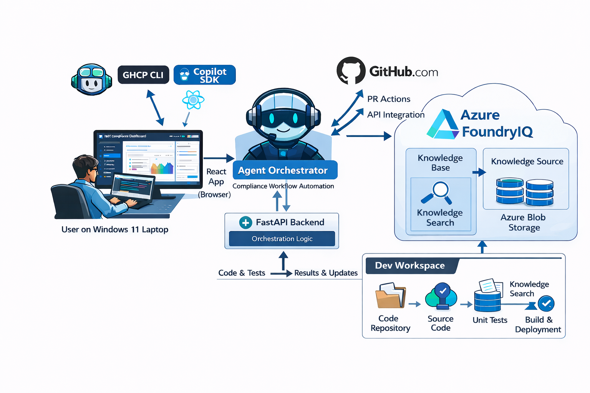

# Fleet Compliance Agent Demo

**Demonstrating GitHub Copilot CLI/SDK Integration for Enterprise Fleet Management**

This demo showcases a Python-based compliance agent that automatically enforces organizational policies across a fleet of microservices using GitHub Copilot [CLI SDK](https://github.com/github/copilot-sdk) capabilities.

---

## 💡 Why GitHub Copilot CLI SDK?

**GitHub Copilot CLI** is typically used for interactive, natural language conversations - a developer types a question and gets a response. But what if you could harness that same AI capability **programmatically**?

The **GitHub Copilot CLI SDK** unlocks exactly this. By exposing the Copilot CLI through a Python SDK, it transforms from a conversational tool into a **programmable agent brain**.

**How It Works:** The Python SDK spawns the Copilot CLI in **server mode** and communicates via **JSON-RPC**. Your code registers tools, sends prompts, and receives events - while the CLI handles authentication, model communication, and token management.

```
Your Application
       ↓
   SDK Client
       ↓ JSON-RPC
Copilot CLI (server mode)
       ↓
  GitHub Copilot API
```

```python
# The SDK starts the CLI in server mode and manages the session
client = CopilotClient()
await client.start()  # Spawns copilot CLI as background process

session = await client.create_session({
    "system_message": {"content": SYSTEM_PROMPT},
    "tools": [clone_tool, detect_drift_tool, apply_patches_tool, ...],
})
await session.send({"prompt": "Enforce compliance on contoso-payments-api"})
# SDK autonomously calls tools, reasons over results, and completes the workflow
```

**The Key Insight:** Instead of a human typing prompts, **code drives the conversation** - sending structured prompts to the SDK, registering custom tools, and letting the SDK autonomously decide the execution path.

This pattern enables **enterprise automation scenarios** that would be impossible with interactive CLI usage alone.

> **🔑 Interactive vs. Embedded:** Developers typically use GitHub Copilot CLI or Agent Mode in VS Code **interactively** - asking questions, getting suggestions, and iterating in real-time. In this sample, we take a fundamentally different approach: **we embed the GitHub Copilot SDK directly into an autonomous agent**. The SDK becomes the reasoning engine for a fully automated workflow, not an interactive assistant.

> **⚠️ Preview SDK Notice:** The GitHub Copilot SDK is currently in **preview**. This demo uses version `github-copilot-sdk>=0.1.21`.

---

## 🎯 What This Demo Implements

This demo implements **automated fleet-wide compliance enforcement** - an AI agent that audits multiple microservices, detects policy violations, applies fixes, and creates Pull Requests with evidence.

> **💡 Production vs. Demo Mode:** In a production scenario, this agent would run **headlessly** - processing repositories one after another without any user interface, triggered by a schedule or event. This sample includes a **React-based GUI** to help you visualize and understand how embedding the GitHub Copilot SDK as an autonomous agent works. The GUI provides real-time visibility into the agent's reasoning and tool execution. Note that **human-in-the-loop would still be required** when reviewing and approving the Pull Requests created by the agent - the automation proposes, humans approve.

### SDK & AI Capabilities

| Capability | How It's Used | Implementation |
|------------|---------------|----------------|
| **SDK as Orchestrating Agent** | Copilot SDK is the "brain" that drives the entire compliance workflow end-to-end | SDK receives a single prompt, then autonomously executes all steps |
| **Autonomous Tool Calling** | SDK decides which tools to invoke based on the task | 13 custom tools registered with the SDK |
| **Function Calling** | Tools return structured JSON that the SDK reasons over | Each tool returns `ToolResult` with JSON payload |
| **MCP Server Integration** | External services for approvals and security scans | Change Mgmt (port 4101), Security (port 4102) |
| **RAG (Retrieval-Augmented Generation)** | Policy evidence grounded in organizational knowledge | Azure OpenAI Vector Store with Responses API |
| **Multi-Step Reasoning** | SDK chains tools: clone → analyze → patch → test → PR | Event-driven workflow with state tracking |
| **Real-Time Event Streaming** | Live UI updates as agent executes | WebSocket events via `asyncio.run_coroutine_threadsafe` |

### Compliance Features Demonstrated

| Feature | Description | Policy Reference |
|---------|-------------|------------------|
| **Fleet-Wide Enforcement** | Automate compliance across multiple repos | - |
| **Health Endpoint Detection** | Identify missing `/healthz` and `/readyz` endpoints | OPS-2.1 |
| **Structured Logging** | Detect and add structlog configuration | OBS-1.1 |
| **Trace Propagation** | Add middleware for W3C traceparent correlation | OBS-3.2 |
| **Security Vulnerability Scanning** | Scan dependencies for CVEs (Common Vulnerabilities and Exposures) via MCP server | SEC-2.4 |
| **Risk-Aware Approvals** | Route PRs to appropriate approvers based on service tier | CM-7 |
| **Evidence-Backed PRs** | Include policy citations in PR descriptions | REL-1.0 |

---

## 🏗️ Architecture



```
┌──────────────────────────────────────────────────────────────────────────────┐
│                         FLEET COMPLIANCE AGENT                               │
├──────────────────────────────────────────────────────────────────────────────┤
│  ┌──────────────────────────────────────────────────────────────────────┐    │
│  │              🖥️ Visual UI (React + FastAPI)                          │    │
│  │  ┌─────────────────┐    WebSocket    ┌─────────────────┐             │    │
│  │  │  React Frontend │◄───────────────►│ FastAPI Backend │             │    │
│  │  │  localhost:3000 │   (streaming)   │  localhost:8000 │             │    │
│  │  └─────────────────┘                 └────────┬────────┘             │    │
│  └───────────────────────────────────────────────┼──────────────────────┘    │
│                                                  │ imports                   │
│                                                  ▼                           │
│  ┌────────────────────────────────────────────────────────────────────────┐  │
│  │              🧠 Agent Core (agent_loop.py)                             │  │
│  │  ┌─────────────┐    ┌─────────────┐    ┌─────────────┐                 │  │
│  │  │   GitHub    │    │  Knowledge  │    │   Copilot   │                 │  │
│  │  │   Repos     │    │    Base     │    │    SDK      │                 │  │
│  │  │  (Target)   │    │   (RAG)     │    │ (Agent Brain)│                │  │
│  │  └──────┬──────┘    └──────┬──────┘    └──────┬──────┘                 │  │
│  │         │                  │                  │                        │  │
│  │         ▼                  ▼                  ▼                        │  │
│  │  ┌─────────────────────────────────────────────────────────────┐       │  │
│  │  │          13 CUSTOM TOOLS (Registered with SDK)              │       │  │
│  │  │  rag_search → clone → detect_drift → security_scan →        │       │  │
│  │  │  create_branch → apply_patches → get_approvals →            │       │  │
│  │  │  run_tests → read_file → fix_code → commit → push → PR      │       │  │
│  │  └───────────────────────────┬─────────────────────────────────┘       │  │
│  └──────────────────────────────┼─────────────────────────────────────────┘  │
│                                 │                                            │
│         ┌───────────────────────┼────────────────────┐                       │
│         ▼                       ▼                    ▼                       │
│  ┌─────────────┐          ┌─────────────┐      ┌─────────────┐               │
│  │ Change Mgmt │          │  Security   │      │   GitHub    │               │
│  │ MCP Server  │          │ MCP Server  │      │     CLI     │               │
│  │ (Approvals) │          │   (Scans)   │      │   (PRs)     │               │
│  └─────────────┘          └─────────────┘      └─────────────┘               │
│     :4101                    :4102                 gh                        │
└──────────────────────────────────────────────────────────────────────────────┘
```

### Components

| Component | Purpose | Location |
|-----------|---------|----------|
| **React Frontend** | Visual dashboard with real-time streaming, per-repo checklists | `ui/frontend/` |
| **FastAPI Backend** | WebSocket server for event streaming | `ui/backend/` |
| **Agent Core** | Orchestrates compliance workflow via Copilot SDK | `agent/fleet_agent/agent_loop.py` |
| **Knowledge Base** | Markdown policy documents for RAG | `knowledge/*.md` |
| **Change Mgmt MCP** | Evaluates approval requirements per CM-7 matrix | `mcp/change_mgmt/` |
| **Security MCP** | Scans dependencies for CVE vulnerabilities | `mcp/security/` |
| **GitHub CLI** | Clones repos, creates branches, opens PRs | System tool (`gh`) |

---

## 🔄 How the Agent Works

The agent executes a compliance workflow in **three phases**:

### Phase 1: Discovery & Analysis (BEFORE any code changes)

| Step | Tool | What Happens |
|------|------|--------------|
| 1 | `rag_search` | Search knowledge base for policy requirements |
| 2 | `clone_repository` | Clone the target repo to local workspace |
| 3 | `detect_compliance_drift` | Scan original code for missing endpoints, logging, middleware |
| 4 | `security_scan` | Scan original `requirements.txt` for CVE vulnerabilities |

### Phase 2: Code Modification (MAKING changes)

| Step | Tool | What Happens |
|------|------|--------------|
| 5 | `create_branch` | Create feature branch `chore/fleet-compliance-{timestamp}` |
| 6 | `apply_compliance_patches` | Create/modify files: `middleware.py`, `logging_config.py`, `main.py`, `requirements.txt`, `tests/test_health.py` |

### Phase 3: Validation & Approval (AFTER code changes)

| Step | Tool | What Happens |
|------|------|--------------|
| 7 | `get_required_approvals` | Send modified file list to Change Mgmt MCP to determine approvers |
| 8 | `run_tests` | Run pytest on modified code |
| 8a | `read_file` + `fix_code` | *(If tests fail)* Read failing file, use SDK to generate fix, retry up to 3 times |
| 9 | `commit_changes` | Commit all modifications |
| 10 | `push_branch` | Push branch to GitHub |
| 11 | `create_pull_request` | Open PR with policy evidence, vulnerability report, approval labels |

### Visual Timeline

```
ORIGINAL CODE                              MODIFIED CODE
     │                                          │
     ▼                                          ▼
┌──────────────────────────────────────────────────────────────────────────┐
│  clone → detect_drift → security_scan    │   apply_patches → run_tests   │
│         (analyze original)               │   → fix_code (if needed)      │
│                                          │   (modify & validate)         │
│  ◄────── BEFORE changes ──────►          │  ◄────── AFTER changes ─────► │
└──────────────────────────────────────────────────────────────────────────┘
                                       ▲
                                 Branch created here
```

---

## ⚡ Getting Started

> **Platform:** These instructions are for **Windows** with PowerShell. Adapt paths for other platforms.

### Prerequisites

| Requirement | Purpose | Verification |
|-------------|---------|--------------|
| **Python 3.11+** | Agent and MCP server runtime | `python --version` |
| **Node.js 18+** | Frontend and Copilot CLI | `node --version` |
| **Git** | Repository operations | `git --version` |
| **GitHub CLI** | PR creation, repo management | `gh --version` |
| **Azure CLI** | Azure authentication for RAG | `az --version` |
| **GitHub Copilot License** | Required for Copilot SDK | Check GitHub account |
| **GitHub Copilot CLI** | SDK dependency | `npm list -g @anthropic-ai/copilot` |

### Azure OpenAI Requirements

This project uses **Azure OpenAI's native Vector Store** (NOT Azure AI Search or Foundry indexes).

| Resource | Purpose |
|----------|---------|
| **Azure OpenAI Service** | Hosts the model and vector store |
| **Model Deployment** (e.g., `gpt-4o`) | Required for Responses API with `file_search` |
| **Vector Store** | Stores policy documents for RAG search |

**RBAC:** User must have `Cognitive Services OpenAI User` role and permissions to create vector stores.

---

### Setup Steps

#### 1. Clone This Repository

```powershell
git clone https://github.com/MSFT-Innovation-Hub-India/GHCP-CLI-SDK-PR-AUTOMATION.git
cd ghcp-cli-sdk-sample1
```

#### 2. Create Target Repositories

The agent operates on external GitHub repositories. Push the sample repos:

```powershell
# For each API in sample-repos/:
cd sample-repos\contoso-orders-api
git init && git add . && git commit -m "Initial commit"
git branch -M main
git remote add origin https://github.com/YOUR_USERNAME/contoso-orders-api.git
git push -u origin main
cd ..\..
# Repeat for contoso-payments-api and contoso-catalog-api
```

Update `agent/config/repos.json`:
```json
{
  "repos": [
    "https://github.com/YOUR_USERNAME/contoso-orders-api.git",
    "https://github.com/YOUR_USERNAME/contoso-payments-api.git",
    "https://github.com/YOUR_USERNAME/contoso-catalog-api.git"
  ]
}
```

#### 3. Authenticate

```powershell
az login
az account set --subscription "YOUR_SUBSCRIPTION_NAME"
gh auth login
```

#### 4. Configure Environment

```powershell
cd agent
copy .env.example .env
```

Edit `agent/.env`:
```env
AZURE_OPENAI_ENDPOINT=https://YOUR_RESOURCE.openai.azure.com/openai/v1/
AZURE_OPENAI_DEPLOYMENT=gpt-4o
AZURE_OPENAI_VECTOR_STORE_ID=   # Set by deploy script
COPILOT_CLI_PATH=C:\Users\YOUR_USERNAME\AppData\Roaming\npm\copilot.cmd
CHANGE_MGMT_URL=http://localhost:4101
SECURITY_URL=http://localhost:4102
```

> **Finding Copilot CLI path:** Run `where.exe copilot` or check `%APPDATA%\npm\copilot.cmd`

#### 5. Create Virtual Environments

```powershell
# MCP servers
cd mcp\change_mgmt
python -m venv .venv && .venv\Scripts\Activate.ps1 && pip install -r requirements.txt && deactivate
cd ..\security
python -m venv .venv && .venv\Scripts\Activate.ps1 && pip install -r requirements.txt && deactivate
cd ..\..\agent
python -m venv .venv && .venv\Scripts\Activate.ps1 && pip install -r requirements.txt && deactivate
cd ..
```

#### 6. Deploy Vector Store

```powershell
cd agent
.venv\Scripts\Activate.ps1
python ..\scripts\deploy-vector-store.py
deactivate
cd ..
```

#### 7. Install Frontend

```powershell
cd ui\frontend
npm install
cd ..\..
```

---

### Running the Demo

Open **4 separate terminals**:

| Terminal | Directory | Command |
|----------|-----------|---------|
| 1 | `mcp\change_mgmt` | `.venv\Scripts\Activate.ps1; uvicorn server:app --host 0.0.0.0 --port 4101` |
| 2 | `mcp\security` | `.venv\Scripts\Activate.ps1; uvicorn server:app --host 0.0.0.0 --port 4102` |
| 3 | `ui\backend` | `..\..\agent\.venv\Scripts\python.exe -m uvicorn main:app --host 0.0.0.0 --port 8000` |
| 4 | `ui\frontend` | `npm run dev` |

**Open:** http://localhost:3000

---

## 📁 Project Structure

```
ghcp-cli-sdk-sample1/
├── agent/                      # Fleet compliance agent
│   ├── config/repos.json       # Target repositories
│   ├── fleet_agent/
│   │   ├── agent_loop.py       # Main agentic entry point (SDK-driven)
│   │   ├── github_ops.py       # Git/GitHub operations
│   │   ├── mcp_clients.py      # MCP server clients
│   │   ├── patcher_fastapi.py  # Code patching logic
│   │   └── rag.py              # Knowledge base search (Azure OpenAI)
│   ├── test_sdk_response.py    # SDK response parsing tests
│   ├── requirements.txt
│   └── .env.example
│
├── knowledge/                  # Policy documents (RAG source)
│   ├── CM-7-approval-matrix.md
│   ├── OBS-1.1-structured-logging.md
│   ├── OBS-3.2-trace-propagation.md
│   ├── OPS-2.1-health-readiness.md
│   ├── REL-1.0-pr-gates.md
│   └── SEC-2.4-dependency-vulnerability-response.md
│
├── mcp/                        # MCP servers
│   ├── change_mgmt/server.py   # Approval matrix evaluation
│   └── security/server.py      # Vulnerability scanning
│
├── sample-repos/               # Demo target repos
│   ├── contoso-catalog-api/
│   ├── contoso-orders-api/
│   └── contoso-payments-api/
│
├── scripts/
│   ├── deploy-vector-store.py  # Deploy Azure OpenAI vector store
│   └── push-sample-repos.ps1   # Push samples to GitHub
│
├── images/
│   └── solution-architecture.png  # Architecture diagram
│
├── ui/
│   ├── frontend/               # React app (Vite + Tailwind)
│   └── backend/main.py         # FastAPI WebSocket server
│
├── docs/ARCHITECTURE_FLOW.md
├── DEMO_CHECKLIST.md
└── README.md
```

### Policy ID Naming Conventions

| Prefix | Category | Inspired By |
|--------|----------|-------------|
| **CM** | Configuration Management | NIST 800-53 |
| **OBS** | Observability | SRE/DevOps practices |
| **OPS** | Operations | SRE/Platform operations |
| **REL** | Reliability | Google SRE, AWS Well-Architected |
| **SEC** | Security | NIST, SOC 2, CIS Controls |

---

## 🖥️ Visual UI

The UI provides real-time streaming of agent activity with a **three-panel layout**:

| Panel | Description |
|-------|-------------|
| **Left** | Repo selector, run button, checklist, tool call history |
| **Center** | Agent reasoning/messages (supports markdown) |
| **Right** | Real-time timestamped console logs |

### Key Features

- **Single Repo Selector**: Dropdown to select one repository at a time
- **Real-time Streaming**: Events appear immediately as they happen
- **PR URL Display**: Clickable links to created PRs
- **Per-Repo Checklist**: Step-by-step progress tracking

### WebSocket Events

| Event | Description |
|-------|-------------|
| `agent_start` | Agent execution begins |
| `tool_call_start` / `tool_call_complete` | Tool invocation tracking |
| `agent_message` | Agent reasoning (markdown supported) |
| `checklist_update` | Per-repo step completion |
| `pr_created` | PR URL captured |
| `console_log` | Streaming log with level (info/success/warning/error) |

> **⚠️ Single-User Application:** This UI is for local, single-user execution only. It uses the local user's GitHub and Azure credentials.

---

## 🔧 Customization

| What to Customize | Location |
|-------------------|----------|
| Target repos | `agent/config/repos.json` |
| Policy documents | `knowledge/*.md` |
| Approval rules | `mcp/change_mgmt/server.py` |
| Vulnerability DB | `mcp/security/server.py` |
| Patching logic | `agent/fleet_agent/patcher_fastapi.py` |
| Agent tools | `agent/fleet_agent/agent_loop.py` |

### MCP Server APIs

**Change Management (Port 4101):**
```bash
curl -X POST http://localhost:4101/approval \
  -H "Content-Type: application/json" \
  -d '{"service": "contoso-payments-api", "touched_paths": ["app/auth.py"]}'

# Response: {"required_approvals": ["SRE-Prod", "Security"], "risk_level": "high"}
```

**Security Scan (Port 4102):**
```bash
curl -X POST http://localhost:4102/scan \
  -H "Content-Type: application/json" \
  -d '{"requirements": "requests==2.19.0"}'

# Response: {"findings": [{"name": "requests", "cve": "CVE-2018-18074", "severity": "HIGH"}]}
```

---

## 📋 Sample Target Repositories

The demo includes three intentionally non-compliant FastAPI services:

| Repository | Description | Compliance Gaps |
|------------|-------------|-----------------|
| **contoso-orders-api** | Order management | Missing health endpoints, no structlog, no middleware |
| **contoso-payments-api** | Payment processing (high-impact) | Same as above + vulnerable `requests==2.19.0` |
| **contoso-catalog-api** | Product catalog | Missing health endpoints, no structlog, no middleware |

The **payments** service triggers CM-7.2 (high-impact service), requiring SRE-Prod approval.

---

## 🏢 From POC to Production

This demo implements a pattern applicable to enterprise environments. The **"automation proposes, human approves"** approach is an established GitOps pattern.

**Current Limitations:**
- Single-user, single-machine execution
- No persistent state between runs
- No authentication/authorization
- No job queuing or scheduling

### Related Industry Patterns

| Pattern/Tool | Description |
|--------------|-------------|
| **Backstage** | Developer portal with automation plugins |
| **Dependabot / Renovate** | Automated dependency PRs |
| **GitHub Advanced Security** | Automated security remediation |
| **Policy-as-Code (OPA, Kyverno)** | Declarative policy enforcement |

---

## 🐛 Troubleshooting

| Issue | Solution |
|-------|----------|
| `copilot: command not found` | Set `COPILOT_CLI_PATH` in `.env` to full path (`where.exe copilot`) |
| `DefaultAzureCredential failed` | Run `az login` and verify subscription with `az account show` |
| `Vector store not found` | Run `python scripts/deploy-vector-store.py` |
| `Connection refused :4101/:4102` | Ensure MCP servers are running in separate terminals |
| `gh: not logged in` | Run `gh auth login` |
| `Error adding label` | Agent auto-creates labels; if issues persist, create manually with `gh label create` |

---

## 🔗 Related Resources

- [GitHub Copilot CLI Documentation](https://docs.github.com/en/copilot/github-copilot-in-the-cli)
- [GitHub Copilot SDK (Python)](https://github.com/github/copilot-sdk)
- [MCP (Model Context Protocol) Specification](https://modelcontextprotocol.io/)
- [Azure OpenAI Responses API](https://learn.microsoft.com/en-us/azure/ai-services/openai/how-to/responses)
- [FastAPI Documentation](https://fastapi.tiangolo.com/)

---

## 📄 License

This demo is provided for educational purposes. See LICENSE for details.
