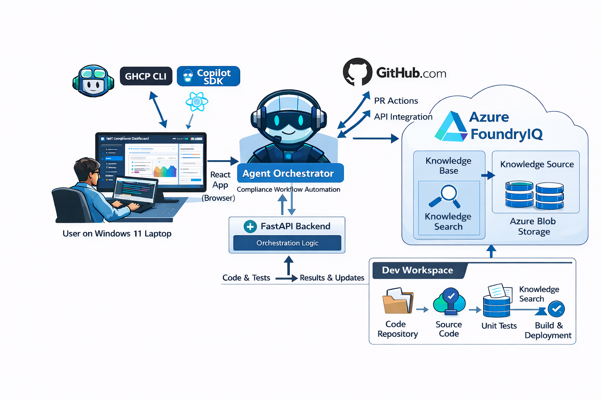

# Fleet Compliance Agent Demo

**Demonstrating GitHub Copilot CLI/SDK Integration for Enterprise Fleet Management**

This demo showcases a Python-based compliance agent that automatically enforces organizational policies across a fleet of microservices using GitHub Copilot [SDK](https://github.com/github/copilot-sdk) capabilities.

---

##  What This Demo Implements

This demo implements **automated fleet-wide compliance enforcement** - an AI agent that audits multiple microservices, detects policy violations, applies fixes, and creates Pull Requests with evidence.

> **💡 Production vs. Demo Mode:** In a production scenario, this agent would run **headlessly** — processing repositories one after another without any user interface, triggered by a schedule or event. This sample provides **two ways to run**:
> - **React GUI** (`ui/`) — A visual dashboard for observing the agent in action. Ideal for demos and understanding how the SDK orchestrates tools in real time.
> - **Console mode** (`agent/fleet_agent/agent_loop.py`) — A headless entry point that loads all repos from `config/repos.json` and processes them **sequentially in a single SDK session**, one after another. Run it directly with `python -m fleet_agent.agent_loop` from the `agent/` directory.
>
> In both modes, **human-in-the-loop is still required** — the agent proposes changes via Pull Requests, humans review and approve.
>
> **No natural language input required.** The only user-provided input is the list of repository URLs in `config/repos.json`. The prompt sent to the Copilot SDK is baked into the application code — there is no interactive prompt or conversational interface.

### SDK & AI Capabilities

| Capability | How It's Used | Implementation |
|------------|---------------|----------------|
| **SDK as Orchestrating Agent** | Copilot SDK is the "brain" that drives the entire compliance workflow end-to-end | SDK receives a single prompt, then autonomously executes all steps |
| **Autonomous Tool Calling** | SDK decides which tools to invoke based on the task | 13 custom tools registered with the SDK |
| **Function Calling** | Tools return structured JSON that the SDK reasons over | Each tool returns `ToolResult` with JSON payload |
| **MCP Server Integration** | External services for approvals and security scans | Change Mgmt (port 4101), Security (port 4102) |
| **RAG (Retrieval-Augmented Generation)** | Policy evidence grounded in organizational knowledge | Azure AI Search Knowledge Base (FoundryIQ) with extractive retrieval |
| **Multi-Step Reasoning** | SDK chains tools: clone → analyze → patch → test → PR | Event-driven workflow with state tracking |
| **Real-Time Event Streaming** | Live UI updates as agent executes | WebSocket events via `asyncio.run_coroutine_threadsafe` |

### Compliance Features Demonstrated

| Feature | Description | Policy Reference |
|---------|-------------|------------------|
| **Fleet-Wide Enforcement** | Automate compliance across multiple repos | - |
| **Health Endpoint Detection** | Identify missing `/healthz` and `/readyz` endpoints | OPS-2.1 |
| **Structured Logging** | Detect and add structlog configuration | OBS-1.1 |
| **Trace Propagation** | Add middleware for W3C traceparent correlation | OBS-3.2 |
| **Security Vulnerability Scanning** | Scan dependencies for CVEs (Common Vulnerabilities and Exposures) via MCP server | SEC-2.4 |
| **Risk-Aware Approvals** | Route PRs to appropriate approvers based on service tier | CM-7 |
| **Evidence-Backed PRs** | Include policy citations in PR descriptions | REL-1.0 |

---

## 🏗️ Architecture



```
┌──────────────────────────────────────────────────────────────────────────────┐
│                         FLEET COMPLIANCE AGENT                               │
├──────────────────────────────────────────────────────────────────────────────┤
│  ┌──────────────────────────────────────────────────────────────────────┐    │
│  │              🖥️ Visual UI (React + FastAPI)                          │    │
│  │  ┌─────────────────┐    WebSocket    ┌─────────────────┐             │    │
│  │  │  React Frontend │◄───────────────►│ FastAPI Backend │             │    │
│  │  │  localhost:3000 │   (streaming)   │  localhost:8000 │             │    │
│  │  └─────────────────┘                 └────────┬────────┘             │    │
│  └───────────────────────────────────────────────┼──────────────────────┘    │
│                                                  │ imports                   │
│                                                  ▼                           │
│  ┌────────────────────────────────────────────────────────────────────────┐  │
│  │              🧠 Agent Core (agent_loop.py)                             │  │
│  │  ┌─────────────┐    ┌─────────────┐    ┌─────────────┐                 │  │
│  │  │   GitHub    │    │  Knowledge  │    │   Copilot   │                 │  │
│  │  │   Repos     │    │    Base     │    │    SDK      │                 │  │
│  │  │  (Target)   │    │   (RAG)     │    │ (Agent Brain)│                │  │
│  │  └──────┬──────┘    └──────┬──────┘    └──────┬──────┘                 │  │
│  │         │                  │                  │                        │  │
│  │         ▼                  ▼                  ▼                        │  │
│  │  ┌─────────────────────────────────────────────────────────────┐       │  │
│  │  │          13 CUSTOM TOOLS (Registered with SDK)              │       │  │
│  │  │  rag_search → clone → detect_drift → security_scan →        │       │  │
│  │  │  create_branch → apply_patches → get_approvals →            │       │  │
│  │  │  run_tests → read_file → fix_code → commit → push → PR      │       │  │
│  │  └───────────────────────────┬─────────────────────────────────┘       │  │
│  └──────────────────────────────┼─────────────────────────────────────────┘  │
│                                 │                                            │
│         ┌───────────────────────┼────────────────────┐                       │
│         ▼                       ▼                    ▼                       │
│  ┌─────────────┐          ┌─────────────┐      ┌─────────────┐               │
│  │ Change Mgmt │          │  Security   │      │   GitHub    │               │
│  │ MCP Server  │          │ MCP Server  │      │     CLI     │               │
│  │ (Approvals) │          │   (Scans)   │      │   (PRs)     │               │
│  └─────────────┘          └─────────────┘      └─────────────┘               │
│     :4101                    :4102                 gh                        │
└──────────────────────────────────────────────────────────────────────────────┘
```

### Components

| Component | Purpose | Location |
|-----------|---------|----------|
| **React Frontend** | Visual dashboard with real-time streaming, per-repo checklists | `ui/frontend/` |
| **FastAPI Backend** | WebSocket server for event streaming | `ui/backend/` |
| **Agent Core** | Orchestrates compliance workflow via Copilot SDK | `agent/fleet_agent/agent_loop.py` |
| **Knowledge Base** | Markdown policy documents for RAG | `knowledge/*.md` |
| **Change Mgmt MCP** | Evaluates approval requirements per CM-7 matrix | `mcp/change_mgmt/` |
| **Security MCP** | Scans dependencies for CVE vulnerabilities | `mcp/security/` |
| **GitHub CLI** | Clones repos, creates branches, opens PRs | System tool (`gh`) |

---

## 🎬 Watch the Demo

[](https://youtu.be/Oyv-tmG7q1k)

*Click the image above to watch the full demo video on YouTube*

---

## 💡 Why GitHub Copilot SDK?

**GitHub Copilot CLI** is typically used for interactive, natural language conversations - a developer types a question and gets a response. But what if you could harness that same AI capability **programmatically**?

The **GitHub Copilot SDK** unlocks exactly this. By exposing the Copilot CLI through a Python SDK, it transforms from a conversational tool into a **programmable agent brain**.

**How It Works:** The Python SDK spawns the Copilot CLI in **server mode** and communicates via **JSON-RPC**. Your code registers tools, sends prompts, and receives events - while the CLI handles authentication, model communication, and token management.

```
Your Application
       ↓
   SDK Client
       ↓ JSON-RPC
Copilot CLI (server mode)
       ↓
  GitHub Copilot API
```

```python
# The SDK starts the CLI in server mode and manages the session
client = CopilotClient()
await client.start()  # Spawns copilot CLI as background process

session = await client.create_session(
    system_message={"mode": "replace", "content": SYSTEM_PROMPT},
    tools=[clone_tool, detect_drift_tool, apply_patches_tool, ...],
    available_tools=["clone_repository", "detect_compliance_drift", ...],
    on_permission_request=lambda req, inv: PermissionRequestResult(kind="approved"),
)
await session.send("Enforce compliance on contoso-payments-api")
# SDK autonomously calls tools, reasons over results, and completes the workflow
```

**The Key Insight:** Instead of a human typing prompts, **code drives the conversation** - sending structured prompts to the SDK, registering custom tools, and letting the SDK autonomously decide the execution path.

This pattern enables **enterprise automation scenarios** that would be impossible with interactive CLI usage alone.

> **🔑 Interactive vs. Embedded:** Developers typically use GitHub Copilot CLI or Agent Mode in VS Code **interactively** - asking questions, getting suggestions, and iterating in real-time. In this sample, we take a fundamentally different approach: **we embed the GitHub Copilot SDK directly into an autonomous agent**. The SDK becomes the reasoning engine for a fully automated workflow, not an interactive assistant.

> **⚠️ Preview SDK Notice:** The GitHub Copilot SDK is currently in **preview**. This demo pins version `github-copilot-sdk==0.2.2` (protocol v3). See [Upgrading the Copilot SDK](#upgrading-the-copilot-sdk) for details.

---

## 🔄 How the Agent Works

The agent executes a compliance workflow in **three phases**:

### Phase 1: Discovery & Analysis (BEFORE any code changes)

| Step | Tool | What Happens |
|------|------|--------------|
| 1 | `rag_search` | Search knowledge base for policy requirements |
| 2 | `clone_repository` | Clone the target repo to local workspace |
| 3 | `detect_compliance_drift` | Scan original code for missing endpoints, logging, middleware |
| 4 | `security_scan` | Scan original `requirements.txt` for CVE vulnerabilities |

### Phase 2: Code Modification (MAKING changes)

| Step | Tool | What Happens |
|------|------|--------------|
| 5 | `create_branch` | Create feature branch `chore/fleet-compliance-{timestamp}` |
| 6 | `apply_compliance_patches` | Create/modify files: `middleware.py`, `logging_config.py`, `main.py`, `requirements.txt`, `tests/test_health.py` |

### Phase 3: Validation & Approval (AFTER code changes)

| Step | Tool | What Happens |
|------|------|--------------|
| 7 | `get_required_approvals` | Send modified file list to Change Mgmt MCP to determine approvers |
| 8 | `run_tests` | Run pytest on modified code |
| 8a | `read_file` + `fix_code` | *(If tests fail)* Read failing file, use SDK to generate fix, retry up to 3 times |
| 9 | `commit_changes` | Commit all modifications |
| 10 | `push_branch` | Push branch to GitHub |
| 11 | `create_pull_request` | Open PR with policy evidence, vulnerability report, approval labels |

### Visual Timeline

```
ORIGINAL CODE                              MODIFIED CODE
     │                                          │
     ▼                                          ▼
┌──────────────────────────────────────────────────────────────────────────┐
│  clone → detect_drift → security_scan    │   apply_patches → run_tests   │
│         (analyze original)               │   → fix_code (if needed)      │
│                                          │   (modify & validate)         │
│  ◄────── BEFORE changes ──────►          │  ◄────── AFTER changes ─────► │
└──────────────────────────────────────────────────────────────────────────┘
                                       ▲
                                 Branch created here
```

---

## ⚡ Getting Started

> **Platform:** These instructions are for **Windows** with PowerShell. Adapt paths for other platforms.

### Prerequisites

| Requirement | Purpose | Verification |
|-------------|---------|--------------|
| **Python 3.11+** | Agent and MCP server runtime | `python --version` |
| **Node.js 18+** | Frontend and Copilot CLI | `node --version` |
| **Git** | Repository operations | `git --version` |
| **GitHub CLI** | PR creation, repo management | `gh --version` |
| **Azure CLI** | Azure authentication for RAG (DefaultAzureCredential) | `az --version` |
| **GitHub Copilot License** | Required for Copilot SDK | Check GitHub account |
| **GitHub Copilot CLI** | SDK dependency | `npm list -g @anthropic-ai/copilot` |

### Azure AI Search Knowledge Base (FoundryIQ) Requirements

This project uses **Azure AI Search Knowledge Base** (FoundryIQ) for RAG — NOT Azure OpenAI Vector Store.

| Resource | Purpose |
|----------|----------|
| **Azure Storage Account** | Blob container holding the policy markdown files from `knowledge/` |
| **Azure AI Search Service** | Hosts the knowledge base, knowledge sources, and local indexes |
| **Knowledge Source** | Points to the Azure Blob Storage container; automatically indexes documents and creates a local index in FoundryIQ |
| **Knowledge Base** | Consumes the knowledge source; powered by an LLM (e.g., `gpt-4o`) with configurable instructions, output mode, and reasoning effort |
| **Azure OpenAI Model** (e.g., `gpt-4o`) | Used by the knowledge base internally for reranking and answer generation (configured in KB, not in agent code) |

#### FoundryIQ Setup Pipeline

```
┌──────────────────┐     upload      ┌──────────────────────┐
│  knowledge/*.md  │ ──────────────► │  Azure Blob Storage  │
│  (policy docs)   │                 │  (container)         │
└──────────────────┘                 └──────────┬───────────┘
                                                │
                                                │ points to
                                                ▼
┌───────────────────────────────────────────────────────────────┐
│               Azure AI Search (FoundryIQ)                     │
│  ┌─────────────────────────────────────────────────────┐      │
│  │  Knowledge Source                                   │      │
│  │  • Data source: Azure Blob Storage container        │      │
│  │  • Auto-indexes documents on creation               │      │
│  │  • Creates a local index in FoundryIQ               │      │
│  └──────────────────────┬──────────────────────────────┘      │
│                         │ consumed by                         │
│                         ▼                                     │
│  ┌─────────────────────────────────────────────────────┐      │
│  │  Knowledge Base                                     │      │
│  │  • Powered by LLM (gpt-4o)                          │      │
│  │  • Output mode: Extractive data                     │      │
│  │  • Reasoning effort: low                            │      │
│  │  • Custom instructions for retrieval                │      │
│  └─────────────────────────────────────────────────────┘      │
└───────────────────────────────────────────────────────────────┘
```

**RBAC:** User must have access to the Azure AI Search knowledge base via `DefaultAzureCredential` (Managed Identity, Azure CLI, etc.).

> **Note:** Azure OpenAI is used **only** by the knowledge base internally for reranking — the agent code does NOT call Azure OpenAI directly. All LLM reasoning comes from the GitHub Copilot SDK.

---

### Setup Steps

#### 1. Clone This Repository

```powershell
git clone https://github.com/MSFT-Innovation-Hub-India/GHCP-CLI-SDK-PR-AUTOMATION.git
cd ghcp-cli-sdk-sample1
```

#### 2. Create Target Repositories

The agent operates on external GitHub repositories. Push the sample repos:

```powershell
# For each API in sample-repos/:
cd sample-repos\contoso-orders-api
git init && git add . && git commit -m "Initial commit"
git branch -M main
git remote add origin https://github.com/YOUR_USERNAME/contoso-orders-api.git
git push -u origin main
cd ..\..
# Repeat for contoso-payments-api and contoso-catalog-api
```

Update `agent/config/repos.json`:
```json
{
  "repos": [
    "https://github.com/YOUR_USERNAME/contoso-orders-api.git",
    "https://github.com/YOUR_USERNAME/contoso-payments-api.git",
    "https://github.com/YOUR_USERNAME/contoso-catalog-api.git"
  ]
}
```

#### 3. Authenticate

```powershell
az login
az account set --subscription "YOUR_SUBSCRIPTION_NAME"
gh auth login
```

#### 4. Configure Environment

```powershell
cd agent
copy .env.example .env
```

Edit `agent/.env`:
```env
# Azure AI Search Knowledge Base (FoundryIQ)
AZURE_AI_SEARCH_ENDPOINT=https://YOUR_SEARCH_SERVICE.search.windows.net
AZURE_AI_KB_NAME=your-knowledge-base-name
AZURE_AI_KB_REASONING_EFFORT=low

# Copilot SDK
COPILOT_CLI_PATH=C:\Users\YOUR_USERNAME\AppData\Roaming\npm\copilot.cmd

# MCP Servers
CHANGE_MGMT_URL=http://localhost:4101
SECURITY_URL=http://localhost:4102
```

> **Finding Copilot CLI path:** Run `where.exe copilot` or check `%APPDATA%\npm\copilot.cmd`
>
> **Knowledge Base setup:** Create an Azure AI Search knowledge base with a knowledge source pointing to the policy documents in `knowledge/`. Configure the KB with extractive output mode in the Azure portal.

#### 5. Create Virtual Environments

```powershell
# MCP servers
cd mcp\change_mgmt
python -m venv .venv && .venv\Scripts\Activate.ps1 && pip install -r requirements.txt && deactivate
cd ..\security
python -m venv .venv && .venv\Scripts\Activate.ps1 && pip install -r requirements.txt && deactivate
cd ..\..\agent
python -m venv .venv && .venv\Scripts\Activate.ps1 && pip install -r requirements.txt && deactivate
cd ..
```

#### 6. Configure Azure AI Search Knowledge Base

1. **Create an Azure Storage Account** — create a blob container and upload the policy markdown files from `knowledge/` into it
2. **Create an Azure AI Search** resource in the Azure portal
3. **Create a Knowledge Source** in FoundryIQ — point it to the Azure Blob Storage container. FoundryIQ automatically indexes the documents and creates a **local index**
4. **Create a Knowledge Base** — select the knowledge source created above. Configure:
   - **Model:** Select an Azure OpenAI deployment (e.g., `gpt-4o`)
   - **Output mode:** Extractive data (returns verbatim text, not synthesized answers)
   - **Reasoning effort:** Low (configurable via `AZURE_AI_KB_REASONING_EFFORT` env var)
   - **Instructions:** Add retrieval instructions to help the KB map queries to the right policy documents
5. **Set environment variables** in `agent/.env`:
   - `AZURE_AI_SEARCH_ENDPOINT` — the Azure AI Search service endpoint URL
   - `AZURE_AI_KB_NAME` — the knowledge base name

> **Note:** The `scripts/deploy-vector-store.py` script is for the legacy Azure OpenAI Vector Store approach and is no longer needed.

#### 7. Install Frontend

```powershell
cd ui\frontend
npm install
cd ..\..
```

---

### Running the Demo

Open **4 separate terminals**:

| Terminal | Directory | Command |
|----------|-----------|---------|
| 1 | `mcp\change_mgmt` | `.venv\Scripts\Activate.ps1; python server.py` |
| 2 | `mcp\security` | `.venv\Scripts\Activate.ps1; python server.py` |
| 3 | `ui\backend` | `..\..\agent\.venv\Scripts\python.exe -m uvicorn main:app --host 0.0.0.0 --port 8000` |
| 4 | `ui\frontend` | `npm run dev` |

**Open:** http://localhost:3000

---

## 📁 Project Structure

```
ghcp-cli-sdk-sample1/
├── agent/                      # Fleet compliance agent
│   ├── config/repos.json       # Target repositories
│   ├── fleet_agent/
│   │   ├── agent_loop.py       # Main agentic entry point (SDK-driven)
│   │   ├── github_ops.py       # Git/GitHub operations
│   │   ├── mcp_clients.py      # MCP server clients
│   │   ├── patcher_fastapi.py  # Code patching logic
│   │   └── rag.py              # Knowledge base search (Azure AI Search KB / FoundryIQ)
│   ├── test_sdk_response.py    # SDK response parsing tests
│   ├── requirements.txt
│   └── .env.example
│
├── knowledge/                  # Policy documents (RAG source)
│   ├── CM-7-approval-matrix.md
│   ├── OBS-1.1-structured-logging.md
│   ├── OBS-3.2-trace-propagation.md
│   ├── OPS-2.1-health-readiness.md
│   ├── REL-1.0-pr-gates.md
│   └── SEC-2.4-dependency-vulnerability-response.md
│
├── mcp/                        # MCP servers
│   ├── change_mgmt/server.py   # Approval matrix evaluation
│   └── security/server.py      # Vulnerability scanning
│
├── sample-repos/               # Demo target repos
│   ├── contoso-catalog-api/
│   ├── contoso-orders-api/
│   └── contoso-payments-api/
│
├── scripts/
│   ├── deploy-vector-store.py  # Legacy: Deploy Azure OpenAI vector store (not used)
│   └── push-sample-repos.ps1   # Push samples to GitHub
│
├── images/
│   └── solution-architecture.png  # Architecture diagram
│
├── ui/
│   ├── frontend/               # React app (Vite + Tailwind)
│   └── backend/main.py         # FastAPI WebSocket server
│
├── docs/ARCHITECTURE_FLOW.md
├── DEMO_CHECKLIST.md
└── README.md
```

### Policy ID Naming Conventions

| Prefix | Category | Inspired By |
|--------|----------|-------------|
| **CM** | Configuration Management | NIST 800-53 |
| **OBS** | Observability | SRE/DevOps practices |
| **OPS** | Operations | SRE/Platform operations |
| **REL** | Reliability | Google SRE, AWS Well-Architected |
| **SEC** | Security | NIST, SOC 2, CIS Controls |

---

## 🖥️ Visual UI

The UI provides real-time streaming of agent activity with a **three-panel layout**:

| Panel | Description |
|-------|-------------|
| **Left** | Repo selector, run button, checklist, tool call history |
| **Center** | Agent reasoning/messages (supports markdown) |
| **Right** | Real-time timestamped console logs |

### Key Features

- **Single Repo Selector**: Dropdown to select one repository at a time
- **Real-time Streaming**: Events appear immediately as they happen
- **PR URL Display**: Clickable links to created PRs
- **Per-Repo Checklist**: Step-by-step progress tracking

### WebSocket Events

| Event | Description |
|-------|-------------|
| `agent_start` | Agent execution begins |
| `tool_call_start` / `tool_call_complete` | Tool invocation tracking |
| `agent_message` | Agent reasoning (markdown supported) |
| `checklist_update` | Per-repo step completion |
| `pr_created` | PR URL captured |
| `console_log` | Streaming log with level (info/success/warning/error) |

> **⚠️ Single-User Application:** This UI is for local, single-user execution only. It uses the local user's GitHub and Azure credentials.

---

## 🔧 Customization

| What to Customize | Location |
|-------------------|----------|
| Target repos | `agent/config/repos.json` |
| Policy documents | `knowledge/*.md` |
| Approval rules | `mcp/change_mgmt/server.py` |
| Vulnerability DB | `mcp/security/server.py` |
| Patching logic | `agent/fleet_agent/patcher_fastapi.py` |
| Agent tools | `agent/fleet_agent/agent_loop.py` |

### MCP Server APIs

**Change Management (Port 4101):**
```bash
curl -X POST http://localhost:4101/approval \
  -H "Content-Type: application/json" \
  -d '{"service": "contoso-payments-api", "touched_paths": ["app/auth.py"]}'

# Response: {"required_approvals": ["SRE-Prod", "Security"], "risk_level": "high"}
```

**Security Scan (Port 4102):**
```bash
curl -X POST http://localhost:4102/scan \
  -H "Content-Type: application/json" \
  -d '{"requirements": "requests==2.19.0"}'

# Response: {"findings": [{"name": "requests", "cve": "CVE-2018-18074", "severity": "HIGH"}]}
```

---

## 📋 Sample Target Repositories

The demo includes three intentionally non-compliant FastAPI services:

| Repository | Description | Compliance Gaps |
|------------|-------------|-----------------|
| **contoso-orders-api** | Order management | Missing health endpoints, no structlog, no middleware |
| **contoso-payments-api** | Payment processing (high-impact) | Same as above + vulnerable `requests==2.19.0` |
| **contoso-catalog-api** | Product catalog | Missing health endpoints, no structlog, no middleware |

The **payments** service triggers CM-7.2 (high-impact service), requiring SRE-Prod approval.

---

## ⬆️ Upgrading the Copilot SDK

The `github-copilot-sdk` version is **pinned** in `agent/requirements.txt` to prevent silent breakage. The Copilot CLI (Node.js) and the Python SDK are versioned independently — if the CLI auto-updates to a newer protocol version, the pinned SDK may stop working with a **protocol version mismatch** error:

```
SDK expects version 3, but server reports version 4
```

### When to Upgrade

- You see a **protocol version mismatch** error at runtime
- The Copilot CLI was updated (via `npm update -g`) and now uses a newer protocol

### How to Upgrade

```powershell
cd agent
.venv\Scripts\Activate.ps1

# Check current version
pip show github-copilot-sdk

# Upgrade to latest
pip install --upgrade github-copilot-sdk

# Check new version
pip show github-copilot-sdk
```

After upgrading, **check for breaking API changes** — the SDK is in preview and the API surface may change between versions. Key areas to verify:

| Area | Files to Check |
|------|----------------|
| `create_session()` signature | `agent_loop.py`, `patcher_fastapi.py`, `ui/backend/main.py` |
| `system_message` format | Same files — may change between string, dict, or TypedDict |
| `session.send()` signature | Same files — may change between dict and plain string |
| `PermissionRequestResult` fields | Same files — `kind` values may change |
| Import paths | `copilot.tools`, `copilot.session` — module names may be reorganized |
| `ToolResult` / `text_result_for_llm` | `agent_loop.py` — field naming (camelCase vs snake_case) |

Once verified, **pin the new version** in `agent/requirements.txt`:

```
github-copilot-sdk==X.Y.Z
```

### Version History

| SDK Version | Protocol | Key Changes |
|-------------|----------|-------------|
| 0.1.22 | v2 | Original version. `create_session({dict})`, `session.send({"prompt": ...})`, `textResultForLlm`, imports from `copilot.types` |
| 0.2.2 | v3 | Breaking: `create_session(**kwargs)`, `session.send(str)`, `text_result_for_llm`, imports from `copilot.tools`/`copilot.session`, `system_message` must be dict (`{"mode": "replace", "content": ...}`), `on_permission_request` takes 2 args, `kind="approved"` |

---

## 🏢 From POC to Production

This demo implements a pattern applicable to enterprise environments. The **"automation proposes, human approves"** approach is an established GitOps pattern.

**Current Limitations:**
- Single-user, single-machine execution
- No persistent state between runs
- No authentication/authorization
- No job queuing or scheduling

### Related Industry Patterns

| Pattern/Tool | Description |
|--------------|-------------|
| **Backstage** | Developer portal with automation plugins |
| **Dependabot / Renovate** | Automated dependency PRs |
| **GitHub Advanced Security** | Automated security remediation |
| **Policy-as-Code (OPA, Kyverno)** | Declarative policy enforcement |

---

## �️ Responsible AI Considerations

This solution operates as a **headless, autonomous agent** — there is no conversational exchange between the agent and end users. The agent receives hardcoded prompts derived from configuration (`repos.json`, policy documents in `knowledge/`), executes a deterministic workflow, and produces code patches and Pull Requests. Humans re-enter the loop only at the PR review stage.

Given this design, many traditional Responsible AI concerns that apply to interactive AI systems (chatbots, content generators, user-facing assistants) are **not applicable** here:

| RAI Concern | Applicability | Reasoning |
|-------------|---------------|-----------|
| **Harmful content generation** | Not applicable | No user-supplied prompts. All inputs are controlled: repo URLs from config, policy text from curated knowledge base, system prompt hardcoded in source. |
| **Bias and fairness** | Not applicable | The agent makes decisions about source code compliance, not about people. There are no demographic, hiring, lending, or content moderation decisions. |
| **PII and data privacy** | Not applicable | The agent processes source code and dependency manifests. No personal data is ingested, stored, or generated. |
| **Prompt injection** | Minimal risk | There is no user-facing input surface. The only external input is the target repository's source code, which is processed by deterministic analysis (AST parsing, regex) — not passed raw to the LLM. |

### What has been considered

Despite the low-risk profile, the following safeguards are in place:

1. **Human-in-the-loop by design** — The agent proposes changes via Pull Requests; it never auto-merges. The CM-7 approval matrix routes PRs to specific human reviewers (SRE, Security, ServiceOwner) based on service tier and files modified. Every code change requires explicit human approval before reaching production.

2. **Code correctness validation** — All generated patches are validated with `ast.parse()` for syntax correctness before being written. Tests are run (`pytest`) against the patched code before the PR is opened. If tests fail, the agent attempts SDK-based code fixing (up to 3 retries), and the test results are reported in the PR for reviewer awareness.

3. **Grounded outputs (RAG)** — PR descriptions cite evidence from the organization's own policy documents retrieved from the Azure AI Search Knowledge Base (FoundryIQ). The knowledge base uses extractive retrieval, returning verbatim text from policy documents rather than synthesized answers, further reducing hallucination risk in policy citations.

4. **Bounded agent actions** — The Copilot SDK session is restricted to 13 explicitly registered custom tools via the `available_tools` whitelist. The SDK cannot use built-in file-write or terminal tools. All file writes are further constrained by path traversal guards and a workspace-only boundary check.

5. **No retained state or learning** — Each run starts clean — workspaces are ephemeral, state files are cleared, and the SDK session has no memory of prior runs. The agent cannot accumulate or leak context across executions.

6. **Single-user execution context** — The agent runs under the operator's own GitHub and Azure credentials. There is no multi-tenant access, no shared execution context, and no credential delegation. The operator sees exactly what the agent sees.

### When to revisit

These considerations should be re-evaluated if the solution evolves to:
- Accept **user-provided prompts** (e.g., "scan this repo for X") — would introduce prompt injection risk
- Process **external/untrusted repositories** — source code could contain adversarial content in comments or filenames
- Run as a **multi-tenant service** — would require credential isolation and access control
- Generate **user-facing content** beyond PR descriptions — would require content safety filters

---

## �🐛 Troubleshooting

| Issue | Solution |
|-------|----------|
| `copilot: command not found` | Set `COPILOT_CLI_PATH` in `.env` to full path (`where.exe copilot`) |
| `DefaultAzureCredential failed` | Run `az login` and verify subscription with `az account show` |
| `Knowledge base not configured` | Set `AZURE_AI_SEARCH_ENDPOINT` and `AZURE_AI_KB_NAME` in `agent/.env` |
| `Connection refused :4101/:4102` | Ensure MCP servers are running in separate terminals |
| `gh: not logged in` | Run `gh auth login` |
| `Error adding label` | Agent auto-creates labels; if issues persist, create manually with `gh label create` |

---

## 🔗 Related Resources

- [GitHub Copilot CLI Documentation](https://docs.github.com/en/copilot/github-copilot-in-the-cli)
- [GitHub Copilot SDK (Python)](https://github.com/github/copilot-sdk)
- [MCP (Model Context Protocol) Specification](https://modelcontextprotocol.io/)
- [Azure AI Search Knowledge Base (FoundryIQ)](https://learn.microsoft.com/en-us/azure/search/knowledge-base-overview)
- [FastAPI Documentation](https://fastapi.tiangolo.com/)

---

## 📄 License

This demo is provided for educational purposes. See LICENSE for details.
