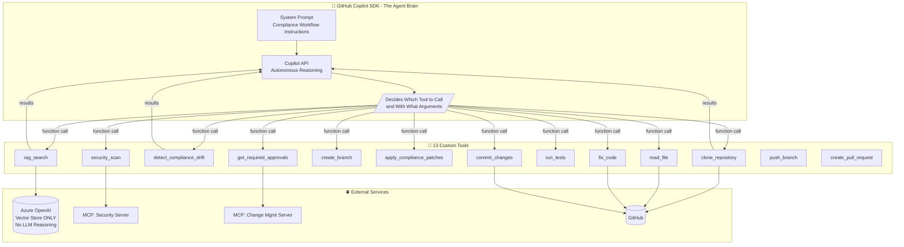
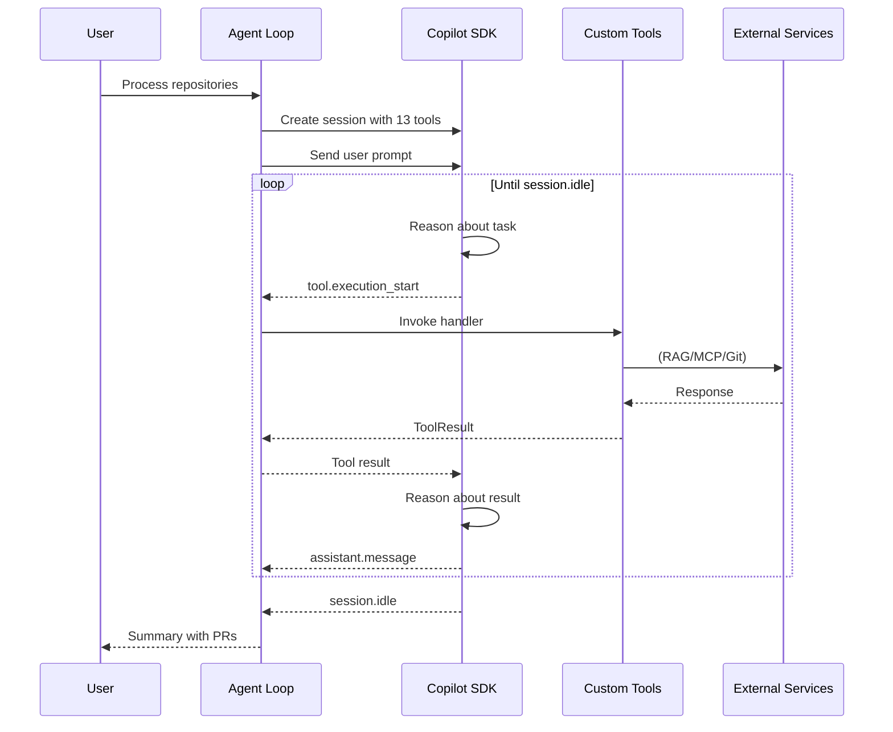
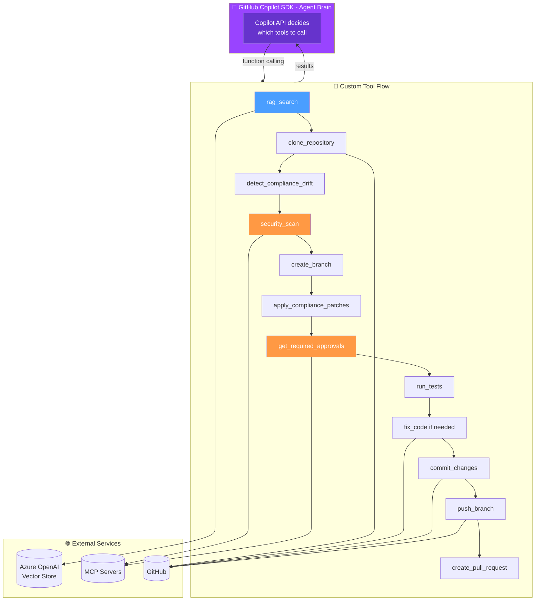
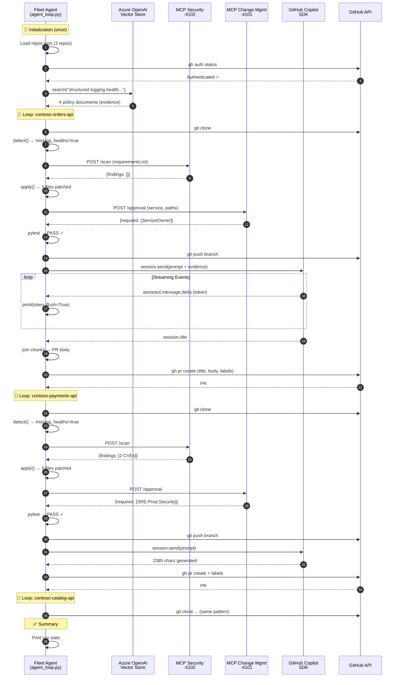
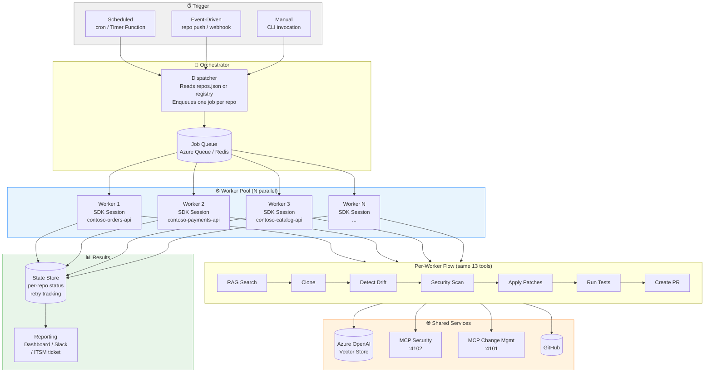

# Fleet Compliance Agent - Architecture & Flow Diagrams

This document provides visual and technical documentation of the Fleet Compliance Agent's **agentic architecture** where the GitHub Copilot SDK acts as the autonomous decision-making brain.

---

## Core Concept: SDK as Agent Brain

The Fleet Compliance Agent is a **TRUE agentic implementation**:
- The **GitHub Copilot SDK** (via Copilot API) is the agent brain
- Custom tools are registered with the SDK and exposed via function calling
- The SDK reasons about tool results and decides next steps
- The agent loop continues until the task is complete

> **Important Distinction:**
> - **Copilot SDK** = Agent brain (LLM reasoning, tool orchestration)
> - **Azure OpenAI** = Vector Store ONLY (RAG search, no LLM reasoning)



---

## Agent Loop Sequence



---

## Simple Flow Diagram (Agentic Mode)



---

## Tool Registration (agent_loop.py)

The agentic implementation registers 13 custom tools with the Copilot SDK:

```python
from copilot import CopilotClient
from copilot.types import Tool, ToolResult

# Create tool with handler and JSON Schema parameters
rag_search_tool = Tool(
    name="rag_search",
    description="Search the knowledge base for compliance policy documents.",
    handler=rag_search_handler,  # Function that returns ToolResult
    parameters={
        "type": "object",
        "properties": {
            "query": {"type": "string", "description": "Search query"}
        },
        "required": ["query"]
    }
)

# Session with ONLY custom tools (available_tools whitelist)
session = await client.create_session({
    "model": "gpt-4o",
    "system_message": {"content": SYSTEM_PROMPT},
    "tools": [rag_search_tool, clone_tool, ..., read_file_tool, fix_code_tool],
    "available_tools": ["rag_search", "clone_repository", ..., "read_file", "fix_code"]  # Whitelist
})
```

**Key Pattern**: Use `available_tools` (not `excluded_tools`) to ensure the SDK only uses custom tools, not built-in ones.

---

## Key Architecture Points

### 1. Loop Structure: Sequential Per-Repository

```
┌─────────────────────────────────────────────────────────────────┐
│  OUTER LOOP: for url in repos (sequential)                      │
│  ┌───────────────────────────────────────────────────────────┐  │
│  │  INNER EXECUTION: All steps for ONE repo (synchronous)    │  │
│  │                                                           │  │
│  │  Clone → Detect → Scan → Patch → Test → Commit → PR       │  │
│  │                                                           │  │
│  │  NO inner loop per tool call - each step runs once        │  │
│  │  Agent controls flow, detects completion, moves to next   │  │
│  └───────────────────────────────────────────────────────────┘  │
└─────────────────────────────────────────────────────────────────┘
```

**The agent uses a TRUE agentic approach** - the Copilot SDK autonomously decides tool order:
1. Each repository is processed **sequentially** (not in parallel)
2. The SDK reasons about the task and calls tools as needed
3. The agent loop (`agent_loop.py`) registers tools and handles events
4. The SDK decides "what to do next" based on system prompt and tool results
5. PR descriptions are generated by the SDK through the `create_pull_request` tool

### 2. Azure OpenAI: Vector Store Only (NOT LLM)

```
┌────────────────────────────────────────────────────────────────────┐
│                     Azure OpenAI Service                           │
│  ┌──────────────────────────────────────────────────────────┐      │
│  │   ✅ USED: Vector Store                                  │     │
│  │   • Endpoint: Configured via AZURE_OPENAI_ENDPOINT       │      │
│  │   • Vector Store ID: AZURE_OPENAI_VECTOR_STORE_ID        |      │
│  │   • Embedding Model: text-embedding-3-small              │      │
│  │   • Responses API with file_search tool                  │      │
│  └──────────────────────────────────────────────────────────┘      │
│                                                                    │
│  ┌──────────────────────────────────────────────────────────┐      │
│  │   ❌ NOT USED: LLM Models (gpt-4o, etc.)                 │     │
│  │   • No chat completions from Azure OpenAI                │      │
│  │   • LLM capability comes from GitHub Copilot SDK         │      │
│  └──────────────────────────────────────────────────────────┘      │
└────────────────────────────────────────────────────────────────────┘
```

### 3. GitHub Copilot SDK Integration

```
┌────────────────────────────────────────────────────────────────────┐
│  GitHub Copilot SDK (github-copilot-sdk)                           │
├────────────────────────────────────────────────────────────────────┤
│                                                                    │
│  Prerequisites:                                                    │
│  • COPILOT_CLI_PATH → C:\Users\...\npm\copilot.cmd (Windows)       │
│  • GitHub CLI authenticated (gh auth login)                        │
│  • Copilot CLI extension (gh extension install github/gh-copilot)  │
│                                                                    │
│  How it works:                                                     │
│  ┌──────────┐    JSON-RPC    ┌─────────────┐     API     ┌───────┐ │
│  │ Python   │ ──────────────▶│ Copilot CLI │ ──────────▶│GitHub │ │
│  │ SDK      │                │ (server     │             │Copilot│ │
│  │          │◀──────────────│  mode)      │◀──────────  │ API   │ │
│  └──────────┘   SSE Events   └─────────────┘             └───────┘ │
│                                                                    │
│  Streaming Implementation:                                         │
│  • CopilotClient.start() launches CLI in server mode               │
│  • create_session() initializes with model + system prompt         │
│  • session.on(handler) registers event callback                    │
│  • session.send(prompt) sends user message                         │
│  • Events: assistant.message.delta (tokens), assistant.message     │
│  • Chunks collected → joined → returned as CopilotDraft            │
│                                                                    │
└────────────────────────────────────────────────────────────────────┘
```

### 4. Event-Driven Streaming

The agent uses event callbacks to stream tool results to the UI:

```python
# Event handler in agent_loop.py

def on_event(event):
    event_type = event.type.value
    
    if event_type == "tool.execution_start":
        tool_name = event.data.tool_name
        args = event.data.arguments
        # Emit to UI via WebSocket
    
    elif event_type == "tool.execution_complete":
        # Tool finished, SDK will reason about result
    
    elif event_type == "assistant.message":
        # Agent reasoning/message - extract PR URLs
    
    elif event_type == "session.idle":
        done.set()  # Agent completed task
```

### 5. MCP Server Integration

```
┌─────────────────────────────────────────────────────────────────┐
│  MCP Servers (Model Context Protocol)                           │
│  Local FastAPI services providing domain-specific tools         │
├─────────────────────────────────────────────────────────────────┤
│                                                                 │
│  Security Scanner (Port 4102)                                   │
│  ┌────────────────────────────────────────────────────────────┐ │
│  │  POST /scan                                                │ │
│  │  Input:  { "requirements": "fastapi==0.100.0\n..." }       │ │
│  │  Output: { "findings": [ { "package": "pyjwt",             │ │
│  │                           "cve": "CVE-2024-...",           │ │
│  │                           "severity": "high" } ] }         │ │
│  └────────────────────────────────────────────────────────────┘ │
│                                                                 │
│  Change Management (Port 4101)                                  │
│  ┌───────────────────────────────────────────────────────────┐  │
│  │  POST /approval                                           │  │
│  │  Input:  { "service": "contoso-payments-api",             │  │
│  │            "touched_paths": ["app/auth.py"] }             │  │
│  │  Output: { "required_approvals": ["SRE-Prod","Security"], │  │
│  │            "risk_level": "high",                          │  │
│  │            "rationale": "High-impact + sensitive files" } │  │
│  └───────────────────────────────────────────────────────────┘  │
│                                                                 │
└─────────────────────────────────────────────────────────────────┘
```

### 6. PR Generation Instruction

The prompt sent to Copilot SDK includes:

```markdown
## Instruction
Write a PR description for a fleet compliance remediation PR. 
Include risk and rollout suggestions.

## Policy Evidence (from knowledge base)
- **OPS-2.1-health-readiness.md**: Health and readiness endpoints 
  are required for all HTTP services deployed on Kubernetes...
- **SEC-2.4-dependency-vulnerability-response.md**: All dependencies 
  must be scanned for CVEs. Critical vulnerabilities must be...
[... 2 more documents ...]

## Changes Made
- app/main.py
- app/middleware.py
- app/logging_config.py
- requirements.txt
- tests/test_health.py

## Output Format
Please provide a professional PR description with:
1. **Summary** - Brief overview of the changes
2. **Changes** - Bullet list of specific modifications
3. **Policy Compliance** - How this addresses fleet policies
4. **Risk Assessment** - Any deployment considerations
5. **Testing** - Verification steps performed
```

### 7. Test Execution & Error Handling

```
┌─────────────────────────────────────────────────────────────────┐
│  Unit Test Execution (per-repository)                           │
├─────────────────────────────────────────────────────────────────┤
│                                                                 │
│  Prerequisites:                                                 │
│  • PYTEST_ENABLED=true in .env                                  │
│  • tests/ directory exists in repository                        │
│                                                                 │
│  Execution Flow:                                                │
│  1. pip install -r requirements.txt (install dependencies)      │
│  2. python -m pytest -q (run tests quietly)                     │
│                                                                 │
│  Error Handling:                                                │
│  • Tests PASS  → Continue to commit/push/PR                     │
│  • Tests FAIL  → Log failure, STILL create PR (human review)    │
│  • Tests ERROR → Catch exception, continue with PR              │
│                                                                 │
│  Why not block on failures?                                     │
│  • Agent patches are deterministic and tested                   │
│  • Existing repo tests may fail for unrelated reasons           │
│  • Human reviewers see test status and decide                   │
│  • Better to surface issue in PR than silently skip             │
│                                                                 │
└─────────────────────────────────────────────────────────────────┘
```

---

## Complete Data Flow



---

## Production Architecture (Headless / Fleet Scale)

The demo runs a single SDK session processing repos sequentially — sufficient for 3-5 repos. For production fleet enforcement (50+ repos), the architecture shifts to **parallel workers with per-repo isolation**.

### Demo vs. Production

| Aspect | Demo (Current) | Production (Target) |
|--------|---------------|---------------------|
| **Execution** | Single SDK session, all repos in one prompt | One SDK session per repo, parallel workers |
| **Concurrency** | Sequential — repo 2 waits for repo 1 | Parallel — configurable worker pool |
| **Trigger** | Manual (UI button or `python -m fleet_agent.agent_loop`) | Scheduled (cron, Azure Timer Function) or event-driven (webhook) |
| **State** | In-memory + ephemeral JSON files | Persistent store (DB or blob) for retry/resume |
| **Failure handling** | Entire run fails if one repo errors | Per-repo retry with exponential backoff |
| **Reporting** | Console stdout or WebSocket stream | Structured results to dashboard/Slack/ITSM |
| **Infrastructure** | Developer laptop | Container (ACA, AKS) or Azure Functions |

### Production Architecture Diagram



### Key Production Design Decisions

1. **One SDK session per repo** — Each worker creates its own `CopilotClient` and session. This avoids context window overflow and enables independent timeouts/retries per repo.

2. **Worker pool sizing** — Limited by Copilot API rate limits and MCP server capacity. Start with 3-5 concurrent workers and tune based on throughput.

3. **Idempotent re-runs** — Before cloning, check if a compliance PR already exists for the target branch. Skip repos that already have an open PR.

4. **State store** — Track per-repo status (`queued`, `in_progress`, `completed`, `failed`, `retrying`). Enables resume-after-failure without re-processing successful repos.

5. **MCP server scaling** — The current single-instance MCP servers become a bottleneck at scale. Deploy behind a load balancer or use the MCP `stdio` transport with per-worker server instances.

6. **Secrets management** — Move from `.env` file to Azure Key Vault or GitHub Actions secrets. Each worker authenticates independently.

### Console Entry Point — Current vs. Parallel

The current `main()` in `agent_loop.py` sends all repos in one prompt:

```python
# Current: sequential, single session
def main():
    repos = load_repos()
    user_input = build_prompt(repos)       # All repos in one prompt
    result = asyncio.run(run_agent(user_input))  # One session
```

A production version would dispatch per-repo:

```python
# Production: parallel, one session per repo
async def main_parallel():
    repos = load_repos()
    semaphore = asyncio.Semaphore(5)  # Max 5 concurrent

    async def process_one(url: str):
        async with semaphore:
            prompt = build_prompt([url])   # Single repo
            return await run_agent(prompt) # Own session

    results = await asyncio.gather(
        *[process_one(url) for url in repos],
        return_exceptions=True
    )
```

---

## Summary Table

| Aspect | Demo | Production |
|--------|------|------------|
| **Loop Structure** | Sequential per-repo, single SDK session | Parallel workers, one SDK session per repo |
| **Tool Autonomy** | Yes - SDK decides tool order based on reasoning | Same |
| **State Persistence** | Ephemeral JSON files, cleared each run | Persistent store with retry tracking |
| **Memory** | No long-term memory; fresh workspace each run | Same — stateless per-repo |
| **Azure OpenAI** | Vector Store ONLY (file_search), NOT LLM | Same |
| **LLM Provider** | GitHub Copilot SDK via Copilot CLI | Same |
| **Streaming** | Event-based: tool calls and messages stream to UI | Structured logs to observability platform |
| **Error Handling** | Tests can fail, PR still created (human decides) | Same + per-repo retry with backoff |
| **Completion Detection** | SDK signals session.idle when task complete | Same + state store updated |
| **Trigger** | Manual (button click or CLI) | Scheduled or event-driven |
| **Concurrency** | 1 (sequential) | N (configurable worker pool) |

