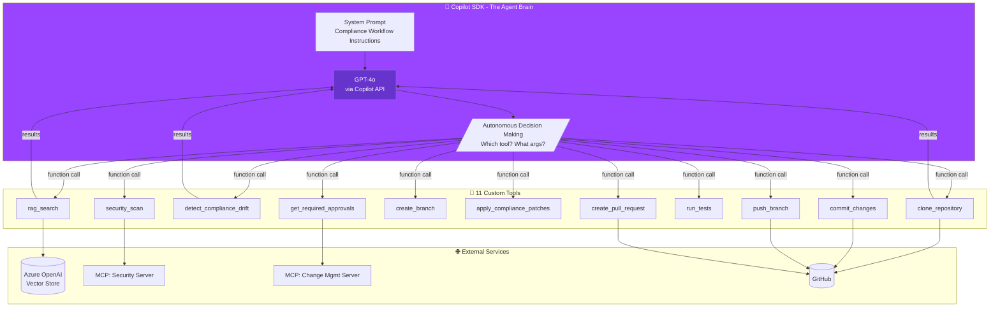
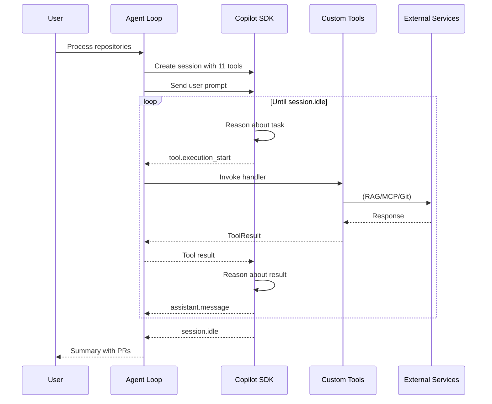
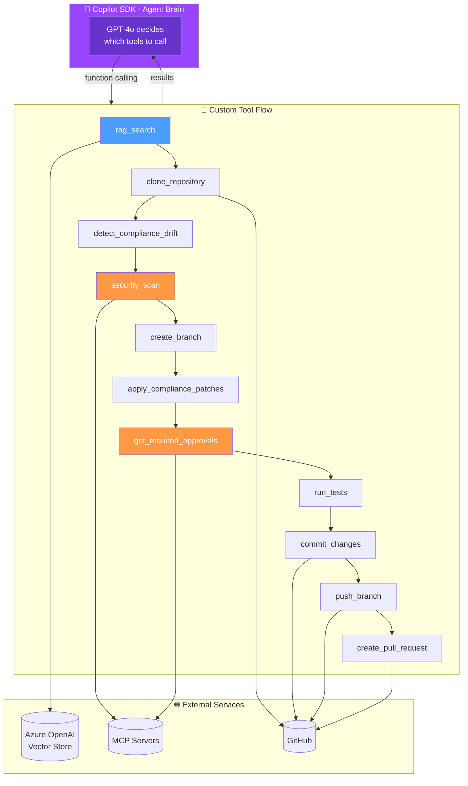
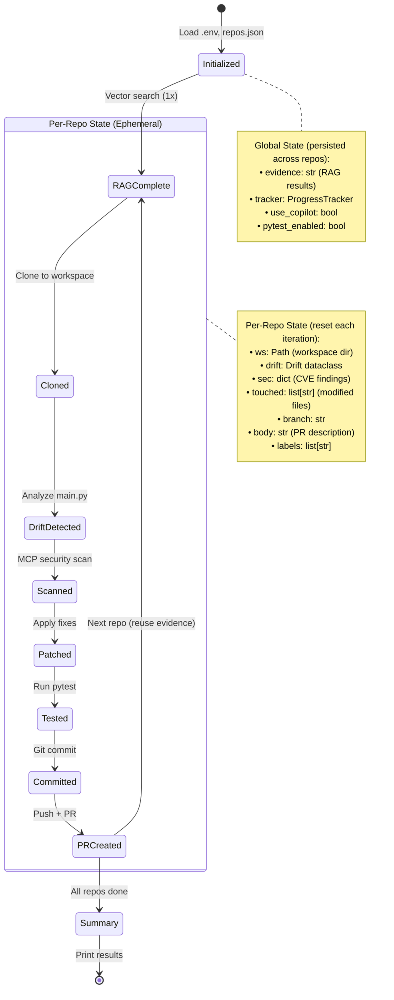
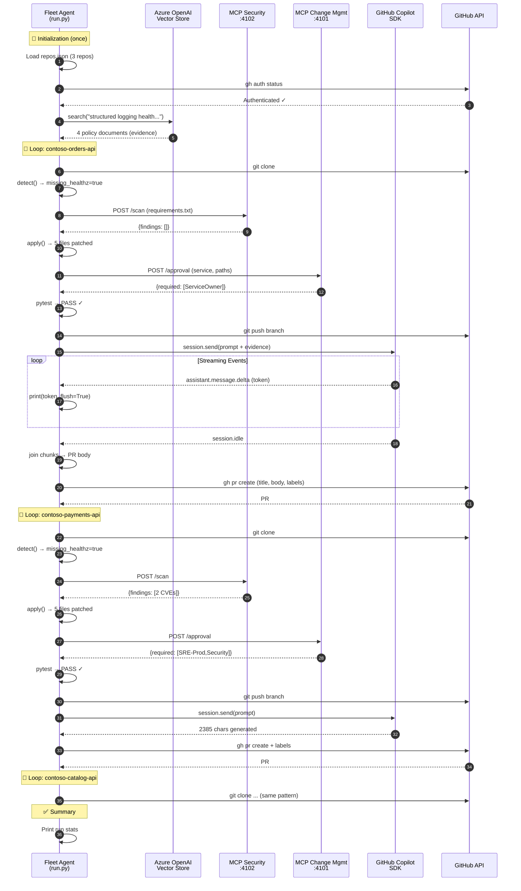

# Fleet Compliance Agent - Architecture & Flow Diagrams

This document provides visual and technical documentation of the Fleet Compliance Agent's **agentic architecture** where the GitHub Copilot SDK acts as the autonomous decision-making brain.

---

## Core Concept: SDK as Agent Brain

The Fleet Compliance Agent is a **TRUE agentic implementation**:
- The Copilot SDK decides which tools to call and in what order
- Custom tools are registered with the SDK and exposed via function calling
- The SDK reasons about tool results and decides next steps
- The agent loop continues until the task is complete



---

## Agent Loop Sequence



---

## Simple Flow Diagram (Agentic Mode)



---

## Tool Registration (agent_loop.py)

The agentic implementation registers 11 custom tools with the Copilot SDK:

```python
from copilot import CopilotClient
from copilot.types import Tool, ToolResult

# Create tool with handler and JSON Schema parameters
rag_search_tool = Tool(
    name="rag_search",
    description="Search the knowledge base for compliance policy documents.",
    handler=rag_search_handler,  # Function that returns ToolResult
    parameters={
        "type": "object",
        "properties": {
            "query": {"type": "string", "description": "Search query"}
        },
        "required": ["query"]
    }
)

# Session with ONLY custom tools (available_tools whitelist)
session = await client.create_session({
    "model": "gpt-4o",
    "system_message": {"content": SYSTEM_PROMPT},
    "tools": [rag_search_tool, clone_tool, ...],
    "available_tools": ["rag_search", "clone_repository", ...]  # Whitelist
})
```

**Key Pattern**: Use `available_tools` (not `excluded_tools`) to ensure the SDK only uses custom tools, not built-in ones.

---

## Comprehensive Flow Diagram (Legacy Reference)

```mermaid
flowchart TB
    subgraph Config["📋 Configuration & State"]
        CFG[repos.json<br/>3 FastAPI repos]
        ENV[.env<br/>USE_COPILOT_SDK=true<br/>PYTEST_ENABLED=true]
        KNOWLEDGE[knowledge/<br/>6 policy documents]
    end

    subgraph Init["🚀 Initialization - Run Once"]
        START([Agent Start]) --> TRACKER[Initialize Progress Tracker<br/>run_id, start_time]
        TRACKER --> AUTH[gh auth status<br/>Verify GitHub CLI]
        AUTH --> LOAD[Load repos.json<br/>→ 3 repositories]
    end

    subgraph RAG["🔍 RAG - Azure OpenAI Vector Store Only"]
        direction TB
        LOAD --> QUERY[Build Query:<br/>'structured logging trace propagation<br/>health readiness approval vulnerability']
        QUERY --> AOAI[(Azure OpenAI<br/>Responses API)]
        AOAI --> VS[(Vector Store<br/>vs_VdxnOBxS...)]
        VS --> EMBED[Embedding Model<br/>text-embedding-3-small]
        EMBED --> SIM[Cosine Similarity<br/>k=4 results]
        SIM --> HITS[Policy Evidence<br/>4 documents returned]
        
        NOTE1[/"⚠️ Azure OpenAI used ONLY<br/>for Vector Store, NOT LLM"/]
    end

    subgraph RepoLoop["🔄 Repository Loop - Sequential Processing"]
        direction TB
        HITS --> FOREACH{{"for repo in repos"}}
        
        FOREACH --> CLONE[Clone Repository<br/>→ workspaces/service-xxxx/]
        CLONE --> DETECT[Detect Drift<br/>patcher_fastapi.detect()]
        
        DETECT --> DRIFT_CHECK{Missing:<br/>healthz? readyz?<br/>structlog? middleware?}
        DRIFT_CHECK -->|None Missing| SKIP_REPO[Skip: No drift]
        
        DRIFT_CHECK -->|Has Drift| SEC_SCAN[MCP: Security Scan<br/>Port 4102]
        SEC_SCAN --> SEC_REQ[POST /scan<br/>requirements.txt content]
        SEC_REQ --> SEC_RESP[Response: CVE findings]
        
        SEC_RESP --> BRANCH[Create Feature Branch<br/>chore/fleet-compliance-xxx]
        BRANCH --> PATCH[Apply Patches<br/>patcher_fastapi.apply()]
        
        PATCH --> PATCH_DETAIL[/"Creates/Modifies:<br/>• app/logging_config.py<br/>• app/middleware.py<br/>• app/main.py<br/>• requirements.txt<br/>• tests/test_health.py"/]
        
        PATCH_DETAIL --> APPROVAL[MCP: Approval Routing<br/>Port 4101]
        APPROVAL --> APPR_REQ[POST /approval<br/>service, touched_paths]
        APPR_REQ --> APPR_RESP[Response: required_approvals<br/>ServiceOwner, SRE-Prod, Security]
        
        APPR_RESP --> TEST_CHECK{tests/ exists<br/>& PYTEST_ENABLED?}
        TEST_CHECK -->|No| SKIP_TEST[Skip Tests]
        TEST_CHECK -->|Yes| PYTEST[pip install -r requirements.txt<br/>python -m pytest -q]
        
        PYTEST --> TEST_RESULT{Tests Pass?}
        TEST_RESULT -->|Pass| COMMIT[Git Commit]
        TEST_RESULT -->|Fail| COMMIT_ANYWAY[Commit Anyway<br/>Note failure in PR]
        SKIP_TEST --> COMMIT
        
        COMMIT --> PUSH[Git Push Branch]
        COMMIT_ANYWAY --> PUSH
    end

    subgraph CopilotSDK["🤖 GitHub Copilot SDK - Streaming"]
        direction TB
        PUSH --> SDK_CHECK{USE_COPILOT_SDK?}
        SDK_CHECK -->|false| TEMPLATE[Deterministic Template<br/>Pre-built PR body]
        
        SDK_CHECK -->|true| SDK_INIT[Initialize CopilotClient<br/>COPILOT_CLI_PATH → copilot.cmd]
        SDK_INIT --> SESSION[Create Session<br/>model: gpt-4o<br/>system_message: PR assistant]
        
        SESSION --> PROMPT[Build Prompt:<br/>• Instruction text<br/>• Policy evidence from RAG<br/>• Changed files list<br/>• Output format spec]
        
        PROMPT --> SEND[session.send prompt]
        
        SEND --> EVENTS{{"Event Loop<br/>session.on event_handler"}}
        
        EVENTS --> |assistant.message.delta| STREAM[Stream Tokens<br/>print chunk, flush=True]
        STREAM --> COLLECT[Append to response_chunks]
        COLLECT --> EVENTS
        
        EVENTS --> |assistant.message| FULL[Full Message Event<br/>Append if non-empty content]
        FULL --> COLLECT
        
        EVENTS --> |session.idle| DONE[Set done.set]
        EVENTS --> |error| ERR[Log Error, done.set]
        
        DONE --> COMBINE[Combine Chunks<br/>full_response = ''.join chunks]
        ERR --> FALLBACK[CLI Fallback<br/>gh copilot suggest]
        
        COMBINE --> CREATE_PR
        FALLBACK --> CREATE_PR
        TEMPLATE --> CREATE_PR
    end

    subgraph GitHub["🐙 GitHub PR Creation"]
        CREATE_PR[Build PR:<br/>title, body, labels] --> GH_API[gh pr create<br/>--base main<br/>--head branch<br/>--title --body]
        GH_API --> LABELS{Approval Labels}
        LABELS -->|SRE-Prod required| LABEL_SRE[Add: needs-sre-approval]
        LABELS -->|Security required| LABEL_SEC[Add: needs-security-approval]
        LABEL_SRE --> PR_CREATED
        LABEL_SEC --> PR_CREATED
        LABELS -->|Only ServiceOwner| PR_CREATED[PR Created ✅]
    end

    subgraph NextOrEnd["⏭️ Loop Control"]
        PR_CREATED --> MORE{More repos?}
        SKIP_REPO --> MORE
        MORE -->|Yes| FOREACH
        MORE -->|No| SUMMARY[Print Run Summary<br/>Duration, Steps, Calls]
    end

    CFG -.-> LOAD
    ENV -.-> AUTH
    ENV -.-> SDK_CHECK
    KNOWLEDGE -.-> VS

    style AOAI fill:#4a9eff,color:white
    style VS fill:#4a9eff,color:white
    style SEC_SCAN fill:#ff9944,color:white
    style APPROVAL fill:#ff9944,color:white
    style SDK_INIT fill:#9944ff,color:white
    style SESSION fill:#9944ff,color:white
    style EVENTS fill:#9944ff,color:white
```

---

## State & Memory Handling



---

## Key Architecture Points

### 1. Loop Structure: Sequential Per-Repository

```
┌─────────────────────────────────────────────────────────────────┐
│  OUTER LOOP: for url in repos (sequential)                      │
│  ┌───────────────────────────────────────────────────────────┐  │
│  │  INNER EXECUTION: All steps for ONE repo (synchronous)    │  │
│  │                                                           │  │
│  │  Clone → Detect → Scan → Patch → Test → Commit → PR      │  │
│  │                                                           │  │
│  │  NO inner loop per tool call - each step runs once        │  │
│  │  Agent controls flow, detects completion, moves to next   │  │
│  └───────────────────────────────────────────────────────────┘  │
└─────────────────────────────────────────────────────────────────┘
```

**The agent is NOT agentic/autonomous per tool call** - it follows a deterministic workflow:
1. Each repository is processed **sequentially** (not in parallel)
2. Within a repo, each step executes **exactly once** in order
3. The workflow code (`run.py`) explicitly controls when to proceed to the next step
4. No LLM decides "what to do next" - the steps are hard-coded
5. The only "intelligence" is in the **patcher** (detecting drift patterns) and **Copilot SDK** (generating PR text)

### 2. Azure OpenAI: Vector Store Only (NOT LLM)

```
┌────────────────────────────────────────────────────────────────┐
│                     Azure OpenAI Service                        │
│  ┌──────────────────────────────────────────────────────────┐  │
│  │   ✅ USED: Vector Store                                   │  │
│  │   • Endpoint: sansri-foundry-hosted-agents-pro.openai... │  │
│  │   • Vector Store ID: vs_VdxnOBxSZXafnJSjR0g7JBBE         │  │
│  │   • Embedding Model: text-embedding-3-small              │  │
│  │   • Responses API with file_search tool                  │  │
│  └──────────────────────────────────────────────────────────┘  │
│                                                                 │
│  ┌──────────────────────────────────────────────────────────┐  │
│  │   ❌ NOT USED: LLM Models (gpt-4o, etc.)                  │  │
│  │   • No chat completions from Azure OpenAI                │  │
│  │   • LLM capability comes from GitHub Copilot SDK         │  │
│  └──────────────────────────────────────────────────────────┘  │
└────────────────────────────────────────────────────────────────┘
```

### 3. GitHub Copilot SDK Integration

```
┌────────────────────────────────────────────────────────────────────┐
│  GitHub Copilot SDK (github-copilot-sdk)                           │
├────────────────────────────────────────────────────────────────────┤
│                                                                    │
│  Prerequisites:                                                    │
│  • COPILOT_CLI_PATH → C:\Users\...\npm\copilot.cmd (Windows)      │
│  • GitHub CLI authenticated (gh auth login)                        │
│  • Copilot CLI extension (gh extension install github/gh-copilot) │
│                                                                    │
│  How it works:                                                     │
│  ┌──────────┐    JSON-RPC    ┌─────────────┐     API     ┌──────┐ │
│  │ Python   │ ──────────────▶│ Copilot CLI │ ──────────▶│GitHub│ │
│  │ SDK      │                │ (server     │             │Copilot││
│  │          │◀──────────────│  mode)      │◀──────────│ API   ││
│  └──────────┘   SSE Events   └─────────────┘             └──────┘ │
│                                                                    │
│  Streaming Implementation:                                         │
│  • CopilotClient.start() launches CLI in server mode              │
│  • create_session() initializes with model + system prompt        │
│  • session.on(handler) registers event callback                   │
│  • session.send(prompt) sends user message                        │
│  • Events: assistant.message.delta (tokens), assistant.message    │
│  • Chunks collected → joined → returned as CopilotDraft           │
│                                                                    │
└────────────────────────────────────────────────────────────────────┘
```

### 4. Streaming Response Handling

```python
# Simplified event handler from copilot_assist.py

def on_event(event):
    event_type = event.type.value
    
    # Option 1: Streaming deltas (tokens as they arrive)
    if event_type in ("assistant.message.delta", "content.delta"):
        chunk = event.data.delta or event.data.content
        response_chunks.append(chunk)
        print(chunk, end="", flush=True)  # Real-time output
    
    # Option 2: Complete message (batched response)
    elif event_type == "assistant.message":
        if event.data.content and len(event.data.content) > 0:
            response_chunks.append(event.data.content)
    
    # Completion signal
    elif event_type == "session.idle":
        done.set()  # Unblock wait

# After all events:
full_response = "".join(response_chunks)
```

### 5. MCP Server Integration

```
┌─────────────────────────────────────────────────────────────────┐
│  MCP Servers (Model Context Protocol)                           │
│  Local FastAPI services providing domain-specific tools         │
├─────────────────────────────────────────────────────────────────┤
│                                                                 │
│  Security Scanner (Port 4102)                                   │
│  ┌───────────────────────────────────────────────────────────┐ │
│  │  POST /scan                                                │ │
│  │  Input:  { "requirements": "fastapi==0.100.0\n..." }      │ │
│  │  Output: { "findings": [ { "package": "pyjwt",            │ │
│  │                           "cve": "CVE-2024-...",           │ │
│  │                           "severity": "high" } ] }         │ │
│  └───────────────────────────────────────────────────────────┘ │
│                                                                 │
│  Change Management (Port 4101)                                  │
│  ┌───────────────────────────────────────────────────────────┐ │
│  │  POST /approval                                            │ │
│  │  Input:  { "service": "contoso-payments-api",             │ │
│  │            "touched_paths": ["app/auth.py"] }              │ │
│  │  Output: { "required_approvals": ["SRE-Prod","Security"], │ │
│  │            "risk_level": "high",                           │ │
│  │            "rationale": "High-impact + sensitive files" }  │ │
│  └───────────────────────────────────────────────────────────┘ │
│                                                                 │
└─────────────────────────────────────────────────────────────────┘
```

### 6. PR Generation Instruction

The prompt sent to Copilot SDK includes:

```markdown
## Instruction
Write a PR description for a fleet compliance remediation PR. 
Include risk and rollout suggestions.

## Policy Evidence (from knowledge base)
- **OPS-2.1-health-readiness.md**: Health and readiness endpoints 
  are required for all HTTP services deployed on Kubernetes...
- **SEC-2.4-dependency-vulnerability-response.md**: All dependencies 
  must be scanned for CVEs. Critical vulnerabilities must be...
[... 2 more documents ...]

## Changes Made
- app/main.py
- app/middleware.py
- app/logging_config.py
- requirements.txt
- tests/test_health.py

## Output Format
Please provide a professional PR description with:
1. **Summary** - Brief overview of the changes
2. **Changes** - Bullet list of specific modifications
3. **Policy Compliance** - How this addresses fleet policies
4. **Risk Assessment** - Any deployment considerations
5. **Testing** - Verification steps performed
```

### 7. Test Execution & Error Handling

```
┌─────────────────────────────────────────────────────────────────┐
│  Unit Test Execution (per-repository)                           │
├─────────────────────────────────────────────────────────────────┤
│                                                                 │
│  Prerequisites:                                                 │
│  • PYTEST_ENABLED=true in .env                                  │
│  • tests/ directory exists in repository                        │
│                                                                 │
│  Execution Flow:                                                │
│  1. pip install -r requirements.txt (install dependencies)     │
│  2. python -m pytest -q (run tests quietly)                    │
│                                                                 │
│  Error Handling:                                                │
│  • Tests PASS  → Continue to commit/push/PR                    │
│  • Tests FAIL  → Log failure, STILL create PR (human review)   │
│  • Tests ERROR → Catch exception, continue with PR             │
│                                                                 │
│  Why not block on failures?                                     │
│  • Agent patches are deterministic and tested                  │
│  • Existing repo tests may fail for unrelated reasons          │
│  • Human reviewers see test status and decide                  │
│  • Better to surface issue in PR than silently skip            │
│                                                                 │
└─────────────────────────────────────────────────────────────────┘
```

---

## Complete Data Flow



---

## Summary Table

| Aspect | Implementation |
|--------|----------------|
| **Loop Structure** | Sequential per-repo, synchronous per-step |
| **Tool Autonomy** | No - workflow is deterministic, not LLM-driven |
| **State Persistence** | Global: evidence, settings. Per-repo: workspace, drift, branch |
| **Memory** | No long-term memory; fresh workspace each run |
| **Azure OpenAI** | Vector Store ONLY (file_search), NOT LLM |
| **LLM Provider** | GitHub Copilot SDK via Copilot CLI |
| **Streaming** | Event-based: delta tokens → chunks → joined response |
| **Error Handling** | Tests can fail, PR still created (human decides) |
| **Completion Detection** | Explicit loop control, not LLM judgment |

