# Fleet Compliance Agent - Architecture & Flow Diagrams

This document provides visual and technical documentation of the Fleet Compliance Agent's **agentic architecture** where the GitHub Copilot SDK acts as the autonomous decision-making brain.

---

## Core Concept: SDK as Agent Brain

The Fleet Compliance Agent is a **TRUE agentic implementation**:
- The **GitHub Copilot SDK** (via Copilot API) is the agent brain
- Custom tools are registered with the SDK and exposed via function calling
- The SDK reasons about tool results and decides next steps
- The agent loop continues until the task is complete

> **Important Distinction:**
> - **Copilot SDK** = Agent brain (LLM reasoning, tool orchestration)
> - **Azure OpenAI** = Vector Store ONLY (RAG search, no LLM reasoning)

```mermaid
flowchart TB
    subgraph AgentBrain["🧠 GitHub Copilot SDK - The Agent Brain"]
        LLM[Copilot API<br/>Autonomous Reasoning]
        PROMPT[System Prompt<br/>Compliance Workflow Instructions]
        DECIDE[/"Decides Which Tool to Call<br/>and With What Arguments"/]
    end

    subgraph CustomTools["🔧 11 Custom Tools"]
        T1[rag_search]
        T2[clone_repository]
        T3[detect_compliance_drift]
        T4[security_scan]
        T5[create_branch]
        T6[apply_compliance_patches]
        T7[get_required_approvals]
        T8[run_tests]
        T9[commit_changes]
        T10[push_branch]
        T11[create_pull_request]
    end

    subgraph External["🌐 External Services"]
        AOAI[(Azure OpenAI<br/>Vector Store ONLY<br/>No LLM Reasoning)]
        MCP_SEC[MCP: Security Server]
        MCP_CM[MCP: Change Mgmt Server]
        GH[(GitHub)]
    end

    LLM --> DECIDE
    PROMPT --> LLM
    DECIDE -->|function call| T1 & T2 & T3 & T4 & T5 & T6 & T7 & T8 & T9 & T10 & T11
    
    T1 -->|results| LLM
    T2 -->|results| LLM
    T3 -->|results| LLM
    
    T1 --> AOAI
    T4 --> MCP_SEC
    T7 --> MCP_CM
    T2 & T9 & T10 & T11 --> GH

    style AgentBrain fill:#9944ff,color:white
    style LLM fill:#6633cc,color:white
```



---

## Agent Loop Sequence


---

## Simple Flow Diagram (Agentic Mode)

```mermaid
flowchart TB
    subgraph SDK["🧠 GitHub Copilot SDK - Agent Brain"]
        LLM[Copilot API decides<br/>which tools to call]
    end

    subgraph Tools["🔧 Custom Tool Flow"]
        A[rag_search] --> B[clone_repository]
        B --> C[detect_compliance_drift]
        C --> D[security_scan]
        D --> E[create_branch]
        E --> F[apply_compliance_patches]
        F --> G[get_required_approvals]
        G --> H[run_tests]
        H --> I[commit_changes]
        I --> J[push_branch]
        J --> K[create_pull_request]
    end

    subgraph External["🌐 External Services"]
        RAG[(Azure OpenAI<br/>Vector Store)]
        MCP[(MCP Servers)]
        GH[(GitHub)]
    end

    LLM -->|function calling| Tools
    Tools -->|results| LLM
    
    A --> RAG
    D & G --> MCP
    B & I & J & K --> GH

    style SDK fill:#9944ff,color:white
    style LLM fill:#6633cc,color:white
    style A fill:#4a9eff,color:white
    style D fill:#ff9944,color:white
    style G fill:#ff9944,color:white
```



---

## Tool Registration (agent_loop.py)

The agentic implementation registers 11 custom tools with the Copilot SDK:

```python
from copilot import CopilotClient
from copilot.types import Tool, ToolResult

# Create tool with handler and JSON Schema parameters
rag_search_tool = Tool(
    name="rag_search",
    description="Search the knowledge base for compliance policy documents.",
    handler=rag_search_handler,  # Function that returns ToolResult
    parameters={
        "type": "object",
        "properties": {
            "query": {"type": "string", "description": "Search query"}
        },
        "required": ["query"]
    }
)

# Session with ONLY custom tools (available_tools whitelist)
session = await client.create_session({
    "model": "gpt-4o",
    "system_message": {"content": SYSTEM_PROMPT},
    "tools": [rag_search_tool, clone_tool, ...],
    "available_tools": ["rag_search", "clone_repository", ...]  # Whitelist
})
```

**Key Pattern**: Use `available_tools` (not `excluded_tools`) to ensure the SDK only uses custom tools, not built-in ones.

---

## Key Architecture Points

### 1. Loop Structure: Sequential Per-Repository

```
┌─────────────────────────────────────────────────────────────────┐
│  OUTER LOOP: for url in repos (sequential)                      │
│  ┌───────────────────────────────────────────────────────────┐  │
│  │  INNER EXECUTION: All steps for ONE repo (synchronous)    │  │
│  │                                                           │  │
│  │  Clone → Detect → Scan → Patch → Test → Commit → PR       │  │
│  │                                                           │  │
│  │  NO inner loop per tool call - each step runs once        │  │
│  │  Agent controls flow, detects completion, moves to next   │  │
│  └───────────────────────────────────────────────────────────┘  │
└─────────────────────────────────────────────────────────────────┘
```

**The agent is NOT agentic/autonomous per tool call** - it follows a deterministic workflow:
1. Each repository is processed **sequentially** (not in parallel)
2. Within a repo, each step executes **exactly once** in order
3. The workflow code (`run.py`) explicitly controls when to proceed to the next step
4. No LLM decides "what to do next" - the steps are hard-coded
5. The only "intelligence" is in the **patcher** (detecting drift patterns) and **Copilot SDK** (generating PR text)

### 2. Azure OpenAI: Vector Store Only (NOT LLM)

```
┌────────────────────────────────────────────────────────────────┐
│                     Azure OpenAI Service                       │
│  ┌──────────────────────────────────────────────────────────┐  │
│  │   ✅ USED: Vector Store                                  │  │
│  │   • Endpoint: sansri-foundry-hosted-agents-pro.openai... │  │
│  │   • Vector Store ID: vs_VdxnOBxSZXafnJSjR0g7JBBE         │  │
│  │   • Embedding Model: text-embedding-3-small              │  │
│  │   • Responses API with file_search tool                  │  │
│  └──────────────────────────────────────────────────────────┘  │
│                                                                │
│  ┌──────────────────────────────────────────────────────────┐  │
│  │   ❌ NOT USED: LLM Models (gpt-4o, etc.)                 │  │
│  │   • No chat completions from Azure OpenAI                │  │
│  │   • LLM capability comes from GitHub Copilot SDK         │  │
│  └──────────────────────────────────────────────────────────┘  │
└────────────────────────────────────────────────────────────────┘
```

### 3. GitHub Copilot SDK Integration

```
┌────────────────────────────────────────────────────────────────────┐
│  GitHub Copilot SDK (github-copilot-sdk)                           │
├────────────────────────────────────────────────────────────────────┤
│                                                                    │
│  Prerequisites:                                                    │
│  • COPILOT_CLI_PATH → C:\Users\...\npm\copilot.cmd (Windows)       │
│  • GitHub CLI authenticated (gh auth login)                        │
│  • Copilot CLI extension (gh extension install github/gh-copilot)  │
│                                                                    │
│  How it works:                                                     │
│  ┌──────────┐    JSON-RPC    ┌─────────────┐     API     ┌───────┐ │
│  │ Python   │ ──────────────▶│ Copilot CLI │ ──────────▶│GitHub │ │
│  │ SDK      │                │ (server     │             │Copilot│ │
│  │          │◀──────────────│  mode)      │◀──────────│ API     │ │
│  └──────────┘   SSE Events   └─────────────┘             └───────┘ │
│                                                                    │
│  Streaming Implementation:                                         │
│  • CopilotClient.start() launches CLI in server mode               │
│  • create_session() initializes with model + system prompt         │
│  • session.on(handler) registers event callback                    │
│  • session.send(prompt) sends user message                         │
│  • Events: assistant.message.delta (tokens), assistant.message     │
│  • Chunks collected → joined → returned as CopilotDraft            │
│                                                                    │
└────────────────────────────────────────────────────────────────────┘
```

### 4. Streaming Response Handling

```python
# Simplified event handler from copilot_assist.py

def on_event(event):
    event_type = event.type.value
    
    # Option 1: Streaming deltas (tokens as they arrive)
    if event_type in ("assistant.message.delta", "content.delta"):
        chunk = event.data.delta or event.data.content
        response_chunks.append(chunk)
        print(chunk, end="", flush=True)  # Real-time output
    
    # Option 2: Complete message (batched response)
    elif event_type == "assistant.message":
        if event.data.content and len(event.data.content) > 0:
            response_chunks.append(event.data.content)
    
    # Completion signal
    elif event_type == "session.idle":
        done.set()  # Unblock wait

# After all events:
full_response = "".join(response_chunks)
```

### 5. MCP Server Integration

```
┌─────────────────────────────────────────────────────────────────┐
│  MCP Servers (Model Context Protocol)                           │
│  Local FastAPI services providing domain-specific tools         │
├─────────────────────────────────────────────────────────────────┤
│                                                                 │
│  Security Scanner (Port 4102)                                   │
│  ┌────────────────────────────────────────────────────────────┐ │
│  │  POST /scan                                                │ │
│  │  Input:  { "requirements": "fastapi==0.100.0\n..." }       │ │
│  │  Output: { "findings": [ { "package": "pyjwt",             │ │
│  │                           "cve": "CVE-2024-...",           │ │
│  │                           "severity": "high" } ] }         │ │
│  └────────────────────────────────────────────────────────────┘ │
│                                                                 │
│  Change Management (Port 4101)                                  │
│  ┌───────────────────────────────────────────────────────────┐  │
│  │  POST /approval                                           │  │
│  │  Input:  { "service": "contoso-payments-api",             │  │
│  │            "touched_paths": ["app/auth.py"] }             │  │
│  │  Output: { "required_approvals": ["SRE-Prod","Security"], │  │
│  │            "risk_level": "high",                          │  │
│  │            "rationale": "High-impact + sensitive files" } │  │
│  └───────────────────────────────────────────────────────────┘  │
│                                                                 │
└─────────────────────────────────────────────────────────────────┘
```

### 6. PR Generation Instruction

The prompt sent to Copilot SDK includes:

```markdown
## Instruction
Write a PR description for a fleet compliance remediation PR. 
Include risk and rollout suggestions.

## Policy Evidence (from knowledge base)
- **OPS-2.1-health-readiness.md**: Health and readiness endpoints 
  are required for all HTTP services deployed on Kubernetes...
- **SEC-2.4-dependency-vulnerability-response.md**: All dependencies 
  must be scanned for CVEs. Critical vulnerabilities must be...
[... 2 more documents ...]

## Changes Made
- app/main.py
- app/middleware.py
- app/logging_config.py
- requirements.txt
- tests/test_health.py

## Output Format
Please provide a professional PR description with:
1. **Summary** - Brief overview of the changes
2. **Changes** - Bullet list of specific modifications
3. **Policy Compliance** - How this addresses fleet policies
4. **Risk Assessment** - Any deployment considerations
5. **Testing** - Verification steps performed
```

### 7. Test Execution & Error Handling

```
┌─────────────────────────────────────────────────────────────────┐
│  Unit Test Execution (per-repository)                           │
├─────────────────────────────────────────────────────────────────┤
│                                                                 │
│  Prerequisites:                                                 │
│  • PYTEST_ENABLED=true in .env                                  │
│  • tests/ directory exists in repository                        │
│                                                                 │
│  Execution Flow:                                                │
│  1. pip install -r requirements.txt (install dependencies)      │
│  2. python -m pytest -q (run tests quietly)                     │
│                                                                 │
│  Error Handling:                                                │
│  • Tests PASS  → Continue to commit/push/PR                     │
│  • Tests FAIL  → Log failure, STILL create PR (human review)    │
│  • Tests ERROR → Catch exception, continue with PR              │
│                                                                 │
│  Why not block on failures?                                     │
│  • Agent patches are deterministic and tested                   │
│  • Existing repo tests may fail for unrelated reasons           │
│  • Human reviewers see test status and decide                   │
│  • Better to surface issue in PR than silently skip             │
│                                                                 │
└─────────────────────────────────────────────────────────────────┘
```

---

## Complete Data Flow

```mermaid
sequenceDiagram
    autonumber
    participant Agent as Fleet Agent<br/>(run.py)
    participant RAG as Azure OpenAI<br/>Vector Store
    participant MCP_Sec as MCP Security<br/>:4102
    participant MCP_CM as MCP Change Mgmt<br/>:4101
    participant Copilot as GitHub Copilot<br/>SDK
    participant GH as GitHub API

    Note over Agent: 🚀 Initialization (once)
    Agent->>Agent: Load repos.json (3 repos)
    Agent->>GH: gh auth status
    GH-->>Agent: Authenticated ✓
    
    Agent->>RAG: search("structured logging health...")
    RAG-->>Agent: 4 policy documents (evidence)
    
    Note over Agent: 🔄 Loop: contoso-orders-api
    Agent->>GH: git clone
    Agent->>Agent: detect() → missing_healthz=true
    Agent->>MCP_Sec: POST /scan (requirements.txt)
    MCP_Sec-->>Agent: {findings: []}
    Agent->>Agent: apply() → 5 files patched
    Agent->>MCP_CM: POST /approval (service, paths)
    MCP_CM-->>Agent: {required: [ServiceOwner]}
    Agent->>Agent: pytest → PASS ✓
    Agent->>GH: git push branch
    
    Agent->>Copilot: session.send(prompt + evidence)
    loop Streaming Events
        Copilot-->>Agent: assistant.message.delta (token)
        Agent->>Agent: print(token, flush=True)
    end
    Copilot-->>Agent: session.idle
    Agent->>Agent: join chunks → PR body
    
    Agent->>GH: gh pr create (title, body, labels)
    GH-->>Agent: PR #9 created ✓
    
    Note over Agent: 🔄 Loop: contoso-payments-api
    Agent->>GH: git clone
    Agent->>Agent: detect() → missing_healthz=true
    Agent->>MCP_Sec: POST /scan
    MCP_Sec-->>Agent: {findings: [2 CVEs]}
    Agent->>Agent: apply() → 5 files patched
    Agent->>MCP_CM: POST /approval
    MCP_CM-->>Agent: {required: [SRE-Prod,Security]}
    Agent->>Agent: pytest → PASS ✓
    Agent->>GH: git push branch
    Agent->>Copilot: session.send(prompt)
    Copilot-->>Agent: 2385 chars generated
    Agent->>GH: gh pr create + labels
    GH-->>Agent: PR #8 created ✓
    
    Note over Agent: 🔄 Loop: contoso-catalog-api
    Agent->>GH: git clone ... (same pattern)
    
    Note over Agent: ✅ Summary
    Agent->>Agent: Print run stats
```



---

## Summary Table

| Aspect | Implementation |
|--------|----------------|
| **Loop Structure** | Sequential per-repo, synchronous per-step |
| **Tool Autonomy** | No - workflow is deterministic, not LLM-driven |
| **State Persistence** | Global: evidence, settings. Per-repo: workspace, drift, branch |
| **Memory** | No long-term memory; fresh workspace each run |
| **Azure OpenAI** | Vector Store ONLY (file_search), NOT LLM |
| **LLM Provider** | GitHub Copilot SDK via Copilot CLI |
| **Streaming** | Event-based: delta tokens → chunks → joined response |
| **Error Handling** | Tests can fail, PR still created (human decides) |
| **Completion Detection** | Explicit loop control, not LLM judgment |

